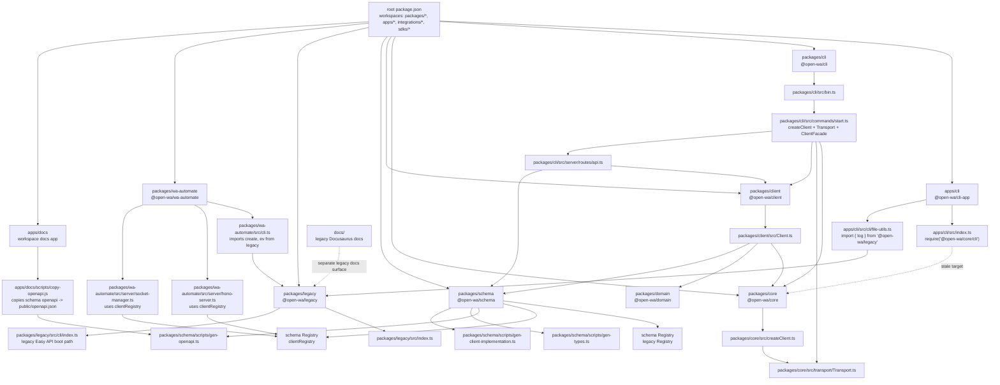
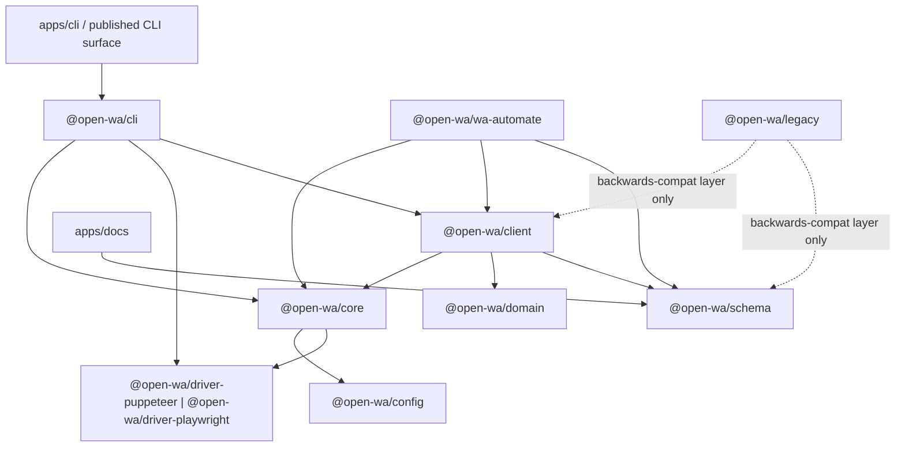
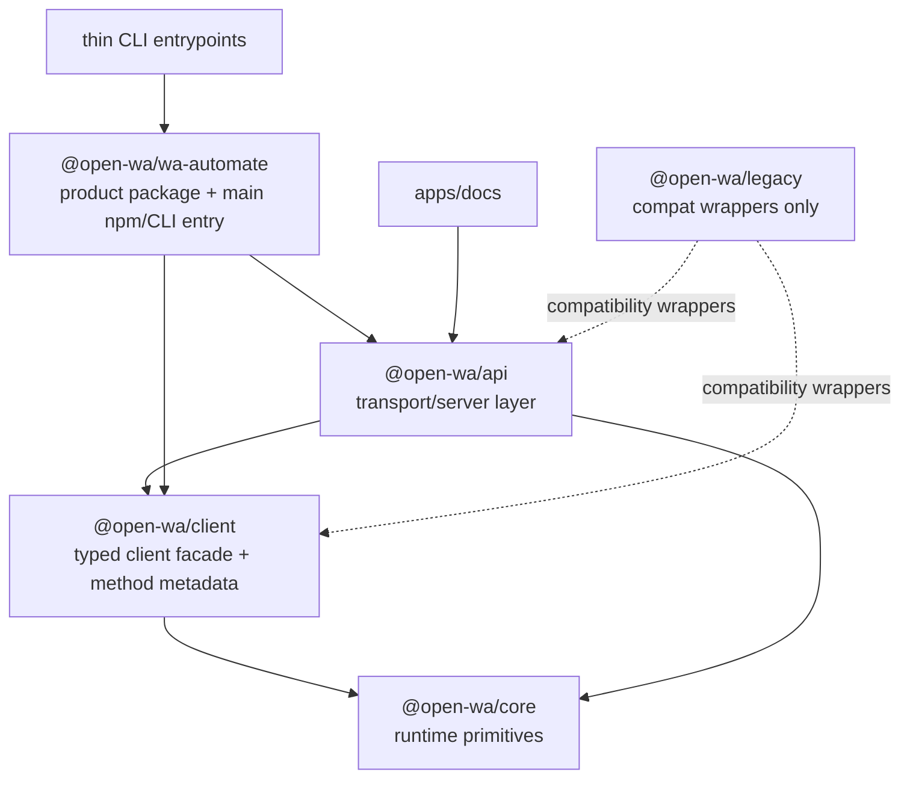

# v5 Runtime Architecture Audit

**Status:** historical audit snapshot from before the shared `@open-wa/api` extraction. See `docs/decisions/2026-03-30-v5-cutover-decisions.md` for the current cutover decisions.

**Date**: 2026-03-30  
**Repository**: `/Users/Mohammed/projects/tools/wa`  
**Purpose**: Document the current runtime/package wiring, the intended v5 target wiring, and the gaps blocking a true v5 cutover.

---

## Executive Summary

The repo contains **substantial v5 work**, but it is **not fully cut over**.

The main disconnect is that there are currently **three CLI/runtime surfaces** in play:

1. `apps/cli` (`@open-wa/cli-app`) — still partially wired to legacy/core assumptions
2. `packages/wa-automate` — schema-v2 server surface, but still bootstraps the client via `@open-wa/legacy`
3. `packages/cli` (`@open-wa/cli`) — the cleanest v5-shaped CLI, built on `@open-wa/core` + `@open-wa/client`

So the repo has a **real v5 spine**, but the published/user-facing entrypoints are still mixed with legacy paths.

---

## Audit Conclusions

### What is real and working in the v5 direction

- `@open-wa/schema` has a real `clientRegistry`-driven model.
- `packages/schema/scripts/gen-openapi.ts` uses `clientRegistry.getAll()`.
- `packages/schema/scripts/gen-types.ts` uses `clientRegistry.getAll()`.
- `packages/wa-automate/src/server/hono-server.ts` registers routes from `clientRegistry`.
- `packages/wa-automate/src/server/socket-manager.ts` registers socket handlers from `clientRegistry`.
- `apps/docs` is a real workspace docs app that copies schema-generated OpenAPI.
- `packages/cli` is a real v5-style CLI that composes `core` + `client` + driver packages.
- The frozen legacy package exposed API concerns in **two** ways: an Easy API CLI server and an embeddable `client.middleware()` surface.

### What is still not cut over

- `apps/cli` still depends on `@open-wa/legacy`.
- `apps/cli/src/cli/file-utils.ts` imports `log` from `@open-wa/legacy`.
- `apps/cli/src/index.ts` still requires `@open-wa/core/cli`, but `@open-wa/core` does not visibly export that subpath.
- `packages/wa-automate/src/cli.ts` still imports `create` and `ev` from `@open-wa/legacy`.
- `packages/schema` is still hybrid at the API surface: it contains both the old `Registry` path and the new `clientRegistry` path, and its package manifest still references `@open-wa/legacy`.
- The repo still carries a separate legacy docs tree in `docs/`, while `apps/docs` is the newer docs surface.
- The current monorepo does not yet have a single reusable owner for HTTP/API concerns; those concerns are split between `packages/wa-automate` and `packages/cli`.

---

## Legacy Baseline: What Users Actually Had In v4

The frozen legacy snapshot at:

`/Users/Mohammed/projects/self/open-wa/open-wa-wa-automate-snapshot-legacy`

changes the migration framing in an important way.

Legacy did **not** only expose an opinionated Easy API server. It exposed API capability in two separate forms:

1. **CLI-hosted Easy API**
   - `src/cli/index.ts`
   - `src/cli/server.ts`
2. **Embeddable Express middleware on the client itself**
   - `src/api/Client.ts` via `client.middleware()`

### What that means

For v5, preserving upgrade safety means preserving **behavioral capability**, not preserving the old package layering.

In other words, users need to retain:

- the ability to run `npx @open-wa/wa-automate` and get Easy API behavior
- the ability to expose a client as middleware inside their own server
- the familiar route/method invocation behaviors
- the same general docs/meta/media/socket affordances

But those do **not** need to remain owned by the legacy `Client` class or by legacy Express code.

---

## Legacy API Ownership Model

### Legacy CLI server ownership

`src/cli/index.ts` did all of this in one boot path:

- generate Postman + Swagger collections before client creation
- configure Express app/server
- configure auth/docs/stats/media/meta middleware
- mount `client.middleware()`
- optionally configure socket.io, tunnel, Chatwoot, Twilio, webhook behavior

### Legacy client ownership

`src/api/Client.ts` also owned a reusable transport surface:

- `client.middleware()`
- method selection via path or `body.method`
- positional args and object args
- `useSessionIdInPath`
- request/session sanity checks

### Key correction to the earlier audit

The earlier audit correctly identified duplicated API concerns in the monorepo, but the frozen legacy codebase makes it clearer that this duplication is partly because **legacy intentionally had both**:

- a productized Easy API server flow
- a reusable embeddable middleware flow

So the real migration requirement is:

> Preserve both capability surfaces, but move them out of legacy ownership and into cleaner v5 package boundaries.

---

## Current-State Wiring

---

## Target v5 Wiring

---

## Current vs Target: Package-by-Package

| Surface | Current wiring | Should be wired to | Gap |
|---|---|---|---|
| `apps/cli` | `@open-wa/core/cli` + `@open-wa/legacy` | `@open-wa/cli` | Entry surface not cut over |
| `packages/cli` | `core` + `client` + driver | same | This is already the clean v5 CLI path |
| `packages/wa-automate` runtime | Hono/socket layer uses schema v2, but CLI boot uses legacy `create()` | `core` + `client` + driver | Hybrid runtime |
| `packages/schema` | v2 registry plus legacy-compatible API surface | schema-first core, no foundational coupling to legacy patterns | Hybrid registry/API surface |

---

## Where API Concerns Live In The New Setup

This is the main architectural gap the legacy comparison makes obvious.

### Legacy shape

In the legacy system, both the **core-ish runtime layer** and the **CLI layer** had API-serving concerns mixed in:

- Express middleware and route concerns existed close to the Easy API runtime.
- The CLI was not just a shell; it also participated in API bootstrapping behavior.

### Current v5 shape

In the current repo, there is **no dedicated `api` package** that owns reusable Hono server concerns for the whole system.

Instead, API/server concerns are currently split like this:

- `packages/core`
  - owns runtime/client creation primitives (`createClient`, transport, events, session, plugins)
  - has **no Hono/Express/server middleware layer**
- `packages/client`
  - owns the typed client facade and domain methods
  - has **no HTTP server concerns**
- `packages/wa-automate`
  - currently owns one Hono/socket server implementation
  - acts like an application/runtime package, not just a library
- `packages/cli`
  - currently owns another API-serving surface via Express routes
  - is also an application package, not just an argument parser

### Practical meaning

So yes: **this is part of the architecture audit**.

The current v5 architecture does **not** yet have a single reusable home for:

- Hono app construction
- shared middleware
- shared route registration strategy
- shared API lifecycle policy
- docs/OpenAPI serving behavior

Right now those concerns are duplicated/split across app-facing packages.

### What the architecture seems to want

There are two reasonable target shapes:

1. **`packages/wa-automate` becomes the canonical server/app package**
   - owns Hono utilities, middleware, route registration, docs serving, socket serving
   - `apps/cli` and/or `packages/cli` become thin entrypoints into it

2. **Create a dedicated API/server package** (for example `@open-wa/api` or `@open-wa/server`)
   - owns reusable Hono utilities
   - `packages/wa-automate` and `packages/cli` both consume it

Given your stated direction — that `packages/wa-automate` will take over the main existing npm package and CLI surface — the cleanest long-term interpretation is:

> `packages/wa-automate` should remain the canonical product/app package, but it should compose a reusable API package rather than own bespoke API internals directly.

That gives you both legacy capability surfaces without legacy coupling:

- `@open-wa/wa-automate` can still power `npx @open-wa/wa-automate`
- a reusable `@open-wa/api` package can provide the embeddable middleware/server factory behavior that used to live on `client.middleware()` and in the legacy CLI server

This is cleaner than making `packages/client` own HTTP concerns again, and cleaner than keeping `packages/cli` and `packages/wa-automate` as parallel API owners.

### Recommended target ownership

### Why this is the best fit

- `core` stays free of HTTP framework concerns
- `client` stays framework-agnostic and focused on typed capabilities
- `api` becomes the reusable owner of:
  - route generation
  - embeddable middleware
  - OpenAPI/Postman generation
  - auth hooks
  - session-pathing policy
  - docs/meta/media helpers
- `wa-automate` remains the user-facing product package and the easiest migration target for existing users

### Migration-safe preservation obligations

These legacy capabilities should be preserved, even if implementation changes:

- `npx @open-wa/wa-automate` Easy API startup UX
- interactive docs at `/api-docs`
- downloadable/generated meta collections (`/meta/swagger.json`, `/meta/postman.json`)
- command/listener discovery endpoints (`/meta/basic/*`)
- media access route behavior where applicable
- optional socket exposure
- optional API key/auth behavior
- `useSessionIdInPath`
- path-based and body-method-based invocation patterns
- positional args and object-args compatibility where practical
- embeddable middleware/server behavior for custom hosts

These are compatibility targets; they do **not** require preserving:

- Express as the implementation framework
- legacy boot order
- legacy package boundaries
- legacy docs generation internals

### Concrete parity checklist from the frozen legacy snapshot

#### HTTP/API invocation contract

Preserve:

- `POST /<clientMethod>`
- body-dispatch `POST /` with `{ method, args }`
- both positional array args and named-object args where practical
- `client.middleware()` / embeddable middleware behavior
- `client.middleware(true)` / `useSessionIdInPath`
- default implicit session behavior where `session` is the baseline ID

#### Important exposed paths

Preserve or intentionally replace with equivalent compatibility:

- `/api-docs/`
- root redirect from `/` to `/api-docs/`
- `/meta/swagger.json`
- `/meta/postman.json`
- `/meta/basic/commands`
- `/meta/basic/listeners`
- `/meta/codegen/:language`
- `/meta/process/exit`
- `/meta/process/restart`
- `/disengage`
- `/media/{fileName}` when media auto-save/decrypt behavior is enabled
- `/chatwoot` and `/chatwoot/checkWebhook` if Chatwoot remains supported

#### Auth and access behavior

If API key mode exists in v5, preserve the user-facing contract:

- accept `key` and/or `api_key` header equivalents where backward compatibility matters
- allow documented integration exceptions like Chatwoot query-key behavior if that integration remains supported
- preserve socket auth capability if socket mode remains part of the public surface

#### Docs / explorer / generation UX

Preserve:

- interactive explorer at `/api-docs/`
- generated/exportable Swagger/OpenAPI collection
- generated/exportable Postman collection
- reverse-proxy-aware `apiHost` behavior for docs/explorer links
- session-aware docs/Postman variable behavior

#### Lifecycle / session / CLI UX

Preserve where feasible:

- `npx @open-wa/wa-automate` Easy API startup flow
- session persistence expectations
- `readyWebhook`
- logout/process-exit semantics or a documented equivalent
- timeout semantics like `0 = wait forever` for relevant auth/QR flows

### Safe to change internally

The following are implementation details and do **not** need to remain the same as long as the capability contract remains:

- Express as the HTTP framework
- Swagger/Postman generation library choice
- exact boot order
- PM2/cloudflared implementation details
- socket implementation details
- internal middleware composition strategy

> `packages/wa-automate` should probably become the canonical application/server entry package, while `core` and `client` remain transport/runtime libraries without HTTP concerns.

That means the lack of a standalone `api` package is not automatically wrong, **if** `packages/wa-automate` is intentionally the place where API concerns are consolidated.

What is wrong today is that this consolidation has **not fully happened yet** because:

- `packages/wa-automate` still boots through legacy for CLI runtime creation
- `packages/cli` still contains its own server/API layer
- `apps/cli` is still on a stale migration path
| `apps/docs` | copies OpenAPI from schema | same | Good direction |
| `docs/` | separate legacy Docusaurus surface | retire or explicitly mark legacy | Two docs systems |

---

## Evidence Anchors

### `apps/cli`

- `apps/cli/package.json`
  - depends on `@open-wa/legacy`
- `apps/cli/src/index.ts`
  - `require('@open-wa/core/cli')`
- `apps/cli/src/cli/file-utils.ts`
  - `import { log } from '@open-wa/legacy'`

### `packages/cli`

- `packages/cli/package.json`
  - depends on `@open-wa/client`, `@open-wa/core`, `@open-wa/schema`, driver packages
- `packages/cli/src/commands/start.ts`
  - builds the runtime from `createClient`, `Transport`, and `ClientFacade`

### `packages/wa-automate`

- `packages/wa-automate/src/cli.ts`
  - imports `create` and `ev` from `@open-wa/legacy`
- `packages/wa-automate/src/server/hono-server.ts`
  - imports and uses `clientRegistry`
- `packages/wa-automate/src/server/socket-manager.ts`
  - imports and uses `clientRegistry`

### `packages/schema`

- `packages/schema/src/registry.ts`
  - contains both the old `Registry` and the new `clientRegistry`
- `packages/schema/scripts/gen-openapi.ts`
  - uses `clientRegistry.getAll()`
- `packages/schema/scripts/gen-types.ts`
  - uses `clientRegistry.getAll()`
- `packages/schema/scripts/gen-client-implementation.ts`
  - generates `BaseClient` from `clientRegistry`

### Docs surfaces

- `apps/docs/scripts/copy-openapi.js`
  - copies generated schema OpenAPI into docs public assets
- `docs/README.md`
  - still describes the old Docusaurus site

---

## Recommended Cutover Order

1. **Make `apps/cli` delegate to `@open-wa/cli`**
   - Remove the stale `@open-wa/core/cli` handoff.
2. **Make `packages/wa-automate/src/cli.ts` use the v5 runtime spine**
   - Compose `core` + `client` + driver instead of `legacy.create()`.
3. **Remove `schema -> legacy` runtime dependency**
   - Keep legacy as a compatibility consumer, not a foundational provider.
4. **Choose one primary docs surface**
   - `apps/docs` should be the v5 docs app; `docs/` should be retired or explicitly labeled legacy.

---

## Release Readiness Assessment

**Monorepo / package split**: mostly real  
**Schema-first generation**: real  
**v5 runtime backbone**: partially real  
**CLI cutover**: incomplete  
**Legacy isolation**: incomplete  
**Docs coherence**: incomplete

### Practical interpretation

The repo is best described as:

> **"v5 architecture substantially built, but not yet fully cut over at the published/runtime entry surfaces."**

That is much closer to reality than the existing blanket claims that the migration is fully complete.
