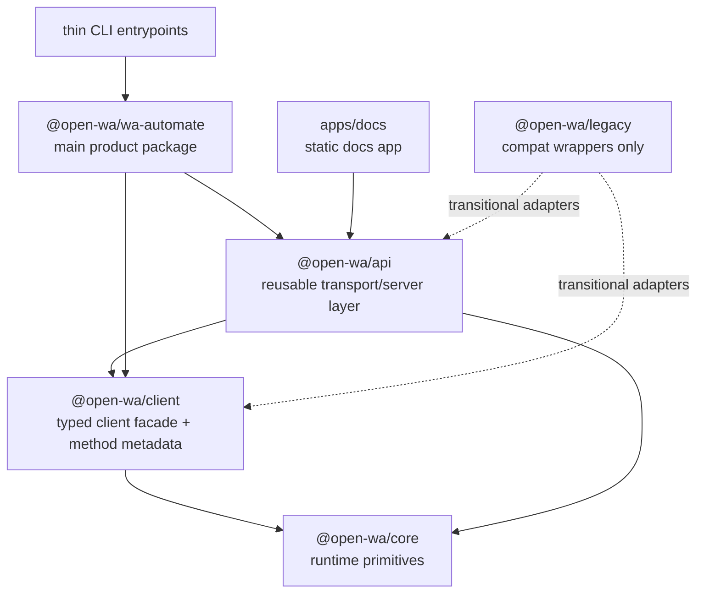

# v5 Easy API Cutover Plan

**Date:** 2026-03-30  
**Repository:** `/Users/Mohammed/projects/tools/wa`  
**Author:** Sisyphus  
**Status:** Draft plan for implementation  
**Related docs:**

- `ai-notes/v5-runtime-architecture-audit.md`
- `notes/issues/00-v5-migration-analysis.md`
- Legacy baseline: `/Users/Mohammed/projects/self/open-wa/open-wa-wa-automate-snapshot-legacy`

---

## 1. Problem Statement

The repository has a substantial v5 foundation, but Easy API ownership is still split across multiple surfaces:

- `apps/cli` is stale and still tied to legacy/core migration assumptions
- `packages/cli` is the cleanest v5-style CLI/runtime path, but owns its own Express API surface
- `packages/wa-automate` has schema-v2 Hono/socket server pieces, but its CLI boot path still goes through `@open-wa/legacy`

This blocks a clean v5 release because the existing npm product users expect:

1. `npx @open-wa/wa-automate` to remain the main Easy API entrypoint
2. no capability regression from v4
3. compatibility for both:
   - Easy API as a CLI-launched server
   - Easy API as embeddable middleware/server behavior

The goal of this cutover is to preserve the v4 **behavior contract** while replacing the v4 **layering and ownership model**.

---

## 2. Success Criteria

v5 is ready for stable release when all of the following are true:

- [ ] `@open-wa/wa-automate` is the canonical user-facing npm package and CLI entrypoint
- [ ] Easy API no longer boots through `@open-wa/legacy`
- [ ] There is one reusable owner for API/server concerns
- [ ] `packages/core` has no HTTP framework concerns
- [ ] `packages/client` has no framework/server ownership, only typed capability ownership
- [ ] legacy Easy API behavior is preserved or intentionally compatibility-wrapped
- [ ] runtime explorer/meta generation remains available, not replaced by static docs alone
- [ ] embeddable middleware/server capability remains available to custom hosts
- [ ] static docs and runtime API explorer have clearly separated responsibilities
- [ ] CLI/config/session/lifecycle semantics are documented and verified by tests

---

## 3. Recommended Target Architecture

## Recommendation

Create a dedicated reusable API package: **`@open-wa/api`** (or `@open-wa/server`), and make `@open-wa/wa-automate` the canonical composition layer for end users.

### Ownership model

- `@open-wa/core`
  - runtime primitives only
  - browser/session/events/transport/plugin infrastructure
  - no HTTP framework ownership

- `@open-wa/client`
  - typed client facade
  - method metadata / schema metadata / invocation manifest
  - no server framework ownership

- `@open-wa/api`
  - reusable API transport layer
  - route generation
  - embeddable middleware
  - OpenAPI/Postman/runtime explorer generation
  - auth/middleware hooks
  - session-pathing compatibility behavior
  - meta/media/docs/stats server helpers

- `@open-wa/wa-automate`
  - end-user product package
  - main npm package
  - main CLI runtime for `npx @open-wa/wa-automate`
  - composes `core + client + api`
  - owns product-level integrations and operational UX

- `@open-wa/cli` / `apps/cli`
  - thin wrappers or internal entrypoints only
  - should not own a separate API architecture

### Target dependency flow



---

## 4. Migration Contract: What Must Be Preserved

The following are **behavioral compatibility requirements**, derived from the frozen legacy package and current user-facing docs.

### 4.1 CLI / Easy API product behavior

Preserve:

- `npx @open-wa/wa-automate`
- `--help` usability and discoverability
- existing Easy API mental model
- session-oriented CLI startup flow
- operational startup output for API explorer and relevant runtime URLs

### 4.2 HTTP invocation contract

Preserve or compatibility-wrap:

- `POST /<clientMethod>`
- body-dispatch `POST /` with `{ method, args }`
- positional arg arrays
- named object args where supported
- `useSessionIdInPath`
- default `session` behavior

### 4.3 Embeddable API capability

Preserve:

- the ability to mount a client-backed API surface inside a custom host application
- the replacement for legacy `client.middleware()`

This may change API shape internally, but an embeddable middleware/server factory must still exist.

### 4.4 Runtime explorer / meta surface

Preserve runtime-facing equivalents of:

- `/api-docs/`
- `/meta/swagger.json`
- `/meta/postman.json`
- `/meta/basic/commands`
- `/meta/basic/listeners`
- `/meta/codegen/:language` (if still strategically relevant)
- `/swagger-stats` or an equivalent metrics/debug surface, if retained

### 4.5 Operational routes / integrations

Preserve where still supported:

- auth/api key behavior
- socket mode
- media exposure when auto-save/decrypt features are enabled
- Chatwoot/Twilio/BotPress/tunnel-ready integration surfaces, if they remain part of product scope
- lifecycle hooks like `readyWebhook`

### 4.6 Session / lifecycle behavior

Preserve or clearly document changes to:

- session persistence expectations
- process exit behavior on logout
- `noKillOnLogout`
- auth/QR timeout semantics
- session-data-only and similar operational modes

---

## 5. Safe Internal Changes

The following may change freely as long as the compatibility contract is preserved:

- Express → Hono
- internal boot order
- route registration internals
- OpenAPI/Postman generation implementation
- socket implementation details
- package boundaries from legacy
- old docs generation internals

---

## 6. Workstreams

## Workstream A — Define the canonical API ownership model

**Goal:** stop the split ownership of API concerns.

### Deliverables

- New package: `packages/api` (name negotiable)
- clear ownership doc for:
  - route generation
  - middleware
  - auth hooks
  - docs generation
  - runtime explorer/meta endpoints
  - server creation helpers

### Acceptance criteria

- `packages/cli` and `packages/wa-automate` no longer own separate API architectures
- shared API/server behavior lives in one reusable package

---

## Workstream B — Define the client capability manifest

**Goal:** make `client` the source of callable capability metadata without giving it HTTP responsibilities.

### Deliverables

- stable method manifest derived from schema/client metadata
- support for:
  - function name
  - aliases
  - namespace/category
  - arg schema / compatibility coercion rules
  - docs text / examples / exposure metadata

### Acceptance criteria

- API generation uses the manifest, not hand-written parallel route definitions
- docs/runtime explorer/Postman/OpenAPI all derive from the same method inventory

---

## Workstream C — Rebuild the embeddable middleware capability in v5

**Goal:** replace legacy `client.middleware()` without re-coupling client to Express/Hono.

### Deliverables

- `createApiMiddleware(client, options)` in `packages/api`
- framework adapters as needed
  - Hono-native
  - Express adapter only if needed for migration bridge/testing

### Required behaviors

- method from path
- method from body
- positional args
- named args
- `useSessionIdInPath`
- request/session guard semantics where still useful

### Acceptance criteria

- custom-host embedding is possible without importing legacy code
- integration tests prove parity with representative legacy requests

---

## Workstream D — Move Easy API product ownership into `wa-automate`

**Goal:** make `@open-wa/wa-automate` the actual v5 product entrypoint.

### Deliverables

- `packages/wa-automate` composes:
  - core client creation
  - api package server/middleware
  - product integrations
  - operational UX
- remove `@open-wa/legacy.create()` boot path from `packages/wa-automate/src/cli.ts`

### Acceptance criteria

- `wa-automate` CLI startup uses v5 runtime directly
- no legacy runtime dependency in the main product boot path

---

## Workstream E — Collapse or retire parallel CLI surfaces

**Goal:** eliminate ambiguity about which CLI is real.

### Deliverables

- either:
  - deprecate `packages/cli` as a separate product surface and make it a wrapper around `wa-automate`, or
  - keep it internal-only and document that clearly
- fix `apps/cli` to stop pointing at `@open-wa/core/cli`

### Acceptance criteria

- there is one authoritative CLI runtime architecture
- no stale migration placeholder path remains

---

## Workstream F — Preserve runtime explorer and generated metadata surfaces

**Goal:** do not regress from legacy runtime explorer behavior.

### Deliverables

- runtime-served `/api-docs/`
- exported `/meta/swagger.json`
- exported `/meta/postman.json`
- command/listener discovery endpoints or intentional equivalents
- clear distinction between:
  - static docs in `apps/docs`
  - runtime API explorer surfaces

### Acceptance criteria

- static docs are not treated as a replacement for runtime explorer functionality
- docs and runtime explorer stay in sync from shared generation inputs

---

## Workstream G — Compatibility & regression testing

**Goal:** prove capability parity while architecture changes.

### Deliverables

- contract tests for representative legacy requests
- golden tests for OpenAPI/Postman shape
- route compatibility tests
- CLI smoke tests for startup UX and generated surfaces
- middleware embedding tests

### Acceptance criteria

- migration-safe parity suite passes before cutover is declared done

---

## 7. Phase Plan

## Phase 0 — Lock the compatibility surface

**Duration:** 0.5–1 day

### Tasks

- finalize compatibility checklist from legacy
- classify each behavior as:
  - must preserve
  - may compatibility-wrap
  - may intentionally deprecate with explicit release notes

### Output

- compatibility matrix committed alongside this plan or linked from it

---

## Phase 1 — Create `packages/api`

**Duration:** 1–2 days

### Tasks

- scaffold package
- define server/middleware abstractions
- move shared API-serving concerns out of `packages/cli` / `packages/wa-automate`

### Output

- reusable package compiles
- initial app/server factory and middleware API exists

---

## Phase 2 — Move route and metadata generation to shared ownership

**Duration:** 1–2 days

### Tasks

- unify method manifest source
- generate route bindings from client/schema metadata
- unify OpenAPI/Postman/runtime explorer generation path

### Output

- no hand-written drift between route inventory and docs inventory

---

## Phase 3 — Rebuild the legacy middleware contract in v5

**Duration:** 1–2 days

### Tasks

- implement embeddable middleware/server behavior in `packages/api`
- cover path/body dispatch and arg coercion
- preserve session-pathing behavior

### Output

- v5 replacement for `client.middleware()` exists and is tested

---

## Phase 4 — Cut over `packages/wa-automate`

**Duration:** 1–2 days

### Tasks

- replace legacy `create` boot path in `packages/wa-automate/src/cli.ts`
- compose `core + client + api`
- wire runtime explorer/meta/socket/auth through the shared API package

### Output

- `@open-wa/wa-automate` runs on v5 runtime without legacy boot dependency

---

## Phase 5 — Collapse redundant CLI surfaces

**Duration:** 0.5–1 day

### Tasks

- rewire or retire `apps/cli`
- make `packages/cli` a thin wrapper or internal tool only

### Output

- one official CLI story

---

## Phase 6 — Verify parity and release readiness

**Duration:** 1–2 days

### Tasks

- run contract/regression suite
- verify generated explorer/meta surfaces
- verify docs and runtime explorer split is correct
- write release notes for any intentional deltas

### Output

- release-candidate checklist signed off

---

## 7A. Concrete Package Breakdown

This section translates the architecture into explicit package responsibilities and migration actions.

### `packages/core`

**Keep / strengthen**

- client creation primitives
- transport selection
- browser/session runtime concerns
- eventing and plugin lifecycle

**Must not own**

- Hono or Express app setup
- route registration
- auth middleware
- docs explorer or OpenAPI serving

**Likely affected files**

- `packages/core/src/createClient.ts`
- `packages/core/src/index.ts`
- `packages/core/src/transport/*`

**Expected changes**

- possibly expose cleaner client bootstrap hooks for `wa-automate`
- no transport/server code should be added here during cutover

---

### `packages/client`

**Keep / strengthen**

- typed client facade
- method signatures
- behavioral capability ownership
- schema/method metadata feed for transport generation

**Must not own**

- framework-specific middleware/server code
- Hono/Express route definitions

**Likely affected files**

- `packages/client/src/Client.ts`
- any future method manifest files under `packages/client/src/*`

**Expected changes**

- expose a stable manifest or method inventory usable by `packages/api`
- ensure metadata is sufficient for:
  - route generation
  - object/array arg compatibility
  - docs examples / descriptions

---

### `packages/schema`

**Keep / strengthen**

- schema definitions
- registry-driven method metadata
- generation scripts

**Must not remain**

- ambiguous hybrid API/legacy coupling that obscures the canonical metadata path

**Likely affected files**

- `packages/schema/src/registry.ts`
- `packages/schema/scripts/gen-openapi.ts`
- `packages/schema/scripts/gen-types.ts`
- `packages/schema/scripts/gen-client-implementation.ts`
- `packages/schema/package.json`

**Expected changes**

- decide whether schema stays the primary registry owner or whether client becomes the runtime manifest owner with schema as source input
- reduce or remove legacy-facing ambiguity in registry ownership

---

### `packages/api` (new)

**This is the key new package.**

**Must own**

- reusable HTTP/API transport layer
- route generation from method metadata
- embeddable middleware/server factory
- runtime explorer/meta/document generation
- auth hooks
- API lifecycle policy helpers
- session-pathing compatibility behavior

**Suggested submodules**

- `packages/api/src/createApiServer.ts`
- `packages/api/src/createApiMiddleware.ts`
- `packages/api/src/routes/generated.ts`
- `packages/api/src/routes/meta.ts`
- `packages/api/src/routes/media.ts`
- `packages/api/src/routes/health.ts`
- `packages/api/src/auth/apiKey.ts`
- `packages/api/src/docs/openapi.ts`
- `packages/api/src/docs/postman.ts`
- `packages/api/src/compat/args.ts`
- `packages/api/src/compat/sessionPath.ts`
- `packages/api/src/types.ts`

**Expected changes**

- absorb shared logic currently duplicated across `packages/cli` and `packages/wa-automate`
- provide the v5 replacement for legacy `client.middleware()`

---

### `packages/wa-automate`

**Keep / strengthen**

- user-facing product package
- operational integrations
- product runtime composition
- socket mode if kept as a product feature

**Must stop doing**

- booting main runtime through `@open-wa/legacy`
- owning a bespoke API architecture separate from shared transport logic

**Likely affected files**

- `packages/wa-automate/src/cli.ts`
- `packages/wa-automate/src/server/hono-server.ts`
- `packages/wa-automate/src/server/socket-manager.ts`
- `packages/wa-automate/src/middleware/*`
- `packages/wa-automate/package.json`

**Expected changes**

- `src/cli.ts` should compose `core + client + api`
- Hono server code should either move into `packages/api` or become thin composition around it
- socket manager should stay here if considered product-level, or move to `packages/api` if socket mode is part of the reusable API contract

---

### `packages/cli`

**Current role**

- v5-style CLI/runtime path
- currently contains its own Express server and route layer

**Likely affected files**

- `packages/cli/src/server/createServer.ts`
- `packages/cli/src/server/routes/api.ts`
- `packages/cli/src/commands/start.ts`
- `packages/cli/src/bin.ts`

**Expected changes**

- delete or hollow out hand-written API route ownership
- consume `packages/api` instead of implementing API directly
- likely become:
  - a thin wrapper around `wa-automate`, or
  - an internal CLI/debug tool

---

### `apps/cli`

**Current role**

- stale wrapper with legacy/core cutover confusion

**Likely affected files**

- `apps/cli/src/index.ts`
- `apps/cli/src/cli/file-utils.ts`
- `apps/cli/package.json`

**Expected changes**

- either remove entirely
- or make it a trivial wrapper with zero architecture logic

---

### `apps/docs`

**Keep / strengthen**

- static public/global docs/reference site
- static OpenAPI distribution

**Must not become**

- the only replacement for runtime explorer/meta surfaces

**Clarification**

- `apps/docs` is the replacement for the public-facing global docs site
- it is **not** the replacement for per-session runtime explorer usage
- runtime Easy API explorer/meta surfaces must remain handled by the runtime/API layer

**Likely affected files**

- `apps/docs/scripts/copy-openapi.js`
- docs navigation/pages that refer to Easy API runtime surfaces

---

## 7B. File-by-File Migration Map

| Current file | Current responsibility | Action | Target owner |
|---|---|---|---|
| `packages/wa-automate/src/cli.ts` | main product CLI boot, but currently uses `@open-wa/legacy.create()` | rewrite | `wa-automate` composing `api` |
| `packages/wa-automate/src/server/hono-server.ts` | Hono app, route registration, API lifecycle, `/health`, `/api` | split/refactor | shared logic to `api`, product composition in `wa-automate` |
| `packages/wa-automate/src/server/socket-manager.ts` | socket mode registration | keep or partially extract | likely `wa-automate`, possibly shared helper |
| `packages/cli/src/server/createServer.ts` | Express app + middleware wiring | replace | `api` package |
| `packages/cli/src/server/routes/api.ts` | hand-written method routes | replace/delete | generated/shared routes in `api` |
| `packages/cli/src/commands/start.ts` | v5 runtime startup path | refactor | thin wrapper over shared server/api composition |
| `apps/cli/src/index.ts` | stale entrypoint to old core/cli path | remove/replace | thin wrapper only |
| `apps/cli/src/cli/file-utils.ts` | still imports legacy log | refactor/remove | no legacy dependency |
| `packages/schema/src/registry.ts` | hybrid registry surfaces | clarify/simplify | schema/client metadata ownership |
| `packages/schema/scripts/gen-openapi.ts` | OpenAPI generation | refactor input source if needed | `schema` or `api` docs layer |
| `packages/schema/scripts/gen-client-implementation.ts` | base client generation | align with manifest ownership | `schema` + `client` |
| `apps/docs/scripts/copy-openapi.js` | static docs asset sync | keep/update | docs app |

---

## 7C. Detailed Phase Breakdown

### Phase 0 — Lock the compatibility surface

#### Tasks

- enumerate every preserved HTTP path and CLI flag from legacy
- classify each as:
  - required for GA
  - required for compatibility wrapper only
  - safe to defer
- record explicit non-goals/deprecations

#### Deliverables

- compatibility matrix markdown appendix
- parity test inventory

#### Exit criteria

- no one can say “I thought that route/flag wasn’t required”

---

### Phase 1 — Create `packages/api`

#### Tasks

- scaffold package manifest and exports
- choose Hono-first vs framework-agnostic core with adapters
- add basic server factory
- add auth/middleware hooks
- add health/meta/docs module boundaries

#### Deliverables

- compiling package with tests
- public API shape documented

#### Exit criteria

- both `packages/cli` and `packages/wa-automate` can theoretically consume it

---

### Phase 2 — Build the method manifest and generated transport

#### Tasks

- define canonical callable-method manifest
- support:
  - route name
  - invocation strategy
  - param schema
  - compatibility coercion
  - docs text/examples
- replace hand-written route inventory with generated/shared route registration

#### Deliverables

- one manifest drives routes + docs + Postman

#### Exit criteria

- no drift between route inventory and explorer inventory

---

### Phase 3 — Recreate embeddable middleware parity

#### Tasks

- create `createApiMiddleware(client, options)`
- support path/body dispatch
- support array/object args
- support session-path compatibility
- decide how to handle legacy quirks like request sanity check headers

#### Deliverables

- migration-ready embeddable API helper

#### Exit criteria

- legacy-style embedding examples are reproducible in v5

---

### Phase 4 — Cut over `wa-automate`

#### Tasks

- replace legacy create path
- move or wrap Hono API code behind shared package
- preserve Easy API startup UX
- preserve runtime explorer/meta/docs URLs
- preserve auth/socket/integration hooks according to scope

#### Deliverables

- v5-native `npx @open-wa/wa-automate`

#### Exit criteria

- product package can be demoed without any legacy runtime boot path

---

### Phase 5 — Collapse parallel CLI surfaces

#### Tasks

- decide fate of `packages/cli`
- decide fate of `apps/cli`
- remove stale imports and package wiring

#### Deliverables

- one authoritative CLI architecture

#### Exit criteria

- repo no longer presents multiple competing API-serving CLIs

---

### Phase 6 — Verify parity and release readiness

#### Tasks

- compare legacy and v5 generated explorer/meta outputs
- run route compatibility suite
- run middleware embedding examples
- validate docs copy and release notes

#### Deliverables

- release gate report

#### Exit criteria

- all P0 compatibility surfaces pass

---

## 7D. Milestones and Gates

| Milestone | Description | Gate |
|---|---|---|
| M0 | Compatibility locked | parity matrix approved |
| M1 | `packages/api` exists | package compiles + public API reviewed |
| M2 | Shared manifest works | routes/docs/Postman derive from one source |
| M3 | Embeddable middleware parity | legacy-style examples pass |
| M4 | `wa-automate` cut over | no legacy create path in main product boot |
| M5 | CLI surfaces simplified | one official CLI story remains |
| M6 | Release ready | parity suite + docs/release notes complete |

---

## 7E. Task Matrix by Domain

| Domain | Work | Owner package | Priority |
|---|---|---|---|
| Runtime | clean bootstrap interfaces | `core` / `wa-automate` | P0 |
| Typed capability model | canonical method manifest | `client` / `schema` | P0 |
| API transport | reusable middleware/server layer | new `api` package | P0 |
| Explorer/docs generation | runtime OpenAPI/Postman/meta | `api` + `apps/docs` | P0 |
| CLI product UX | preserve `npx @open-wa/wa-automate` flow | `wa-automate` | P0 |
| Middleware embedding | replace `client.middleware()` | `api` package | P0 |
| Compatibility tests | route/flag/surface parity | cross-package | P0 |
| Socket mode | preserve or clearly re-scope | `wa-automate` / `api` | P1 |
| Integrations | Chatwoot/Twilio/BotPress/tunnel | `wa-automate` | P2 |
| Redundant entrypoints | collapse `apps/cli` / `packages/cli` ambiguity | app/package wiring | P1 |

---

## 7F. Proposed Testing Breakdown

### Contract tests

- `POST /sendText`
- `POST /` with `{ method: 'sendText', args: [...] }`
- object args dispatch
- session-path mode
- auth required vs no-auth mode

### Runtime explorer tests

- `/api-docs/` loads
- `/meta/swagger.json` exists and is non-empty
- `/meta/postman.json` exists and is non-empty
- command/listener discovery endpoints return real content

### CLI smoke tests

- `npx @open-wa/wa-automate --help`
- startup on default session
- startup with `--session-id`
- startup with API key enabled

### Embedding tests

- host a custom server using the new API middleware/server helper
- prove parity with legacy examples conceptually equivalent to `client.middleware()`

### Regression diff tests

- compare legacy OpenAPI/Postman output shape vs v5 output shape
- compare exposed route inventory vs compatibility matrix

---

## 7G. Implementation Order by File Cluster

### Cluster 1 — New shared API package

- create `packages/api/*`
- establish exports and public interfaces

### Cluster 2 — Current API owners extraction

- refactor `packages/cli/src/server/*`
- refactor `packages/wa-automate/src/server/*`

### Cluster 3 — Product cutover

- rewrite `packages/wa-automate/src/cli.ts`
- align package manifests and bin wiring

### Cluster 4 — Cleanup

- simplify/remove `apps/cli`
- simplify/reposition `packages/cli`

### Cluster 5 — Verification

- add contract tests, explorer tests, smoke tests, and docs checks

---

## 7H. Sequenced Task List Per Package

This section turns the plan into execution order within each package. Tasks are intentionally sequenced to reduce cross-package thrash.

### Package: `packages/api` (new)

#### Sequence

1. Create package scaffold
   - add `package.json`, tsconfig, exports, entrypoints
2. Define public interfaces
   - `createApiServer`
   - `createApiMiddleware`
   - route registration types
   - auth/docs/meta compatibility option types
3. Implement compatibility utilities
   - args normalization (array args, object args)
   - method resolution (path vs body.method)
   - session-path logic
4. Implement generated route registration
   - load method manifest/registry source
   - register callable methods
5. Implement built-in support routes
   - health
   - meta routes
   - docs route wiring
   - media route hooks
6. Implement auth hooks
   - API key middleware
   - optional compatibility aliases for `key` / `api_key`
7. Implement OpenAPI/Postman generation adapters
   - runtime-served outputs
   - reusable generation functions for docs app
8. Add tests
   - route dispatch
   - session-pathing
   - auth behavior
   - docs/meta outputs

#### Recommended commit boundaries

- `feat(api): scaffold shared API package`
- `feat(api): add compatibility dispatch and session path helpers`
- `feat(api): generate callable routes from method metadata`
- `feat(api): add meta docs and auth layers`
- `test(api): add route and compatibility coverage`

---

### Package: `packages/client`

#### Sequence

1. Audit current callable method metadata sources
2. Define canonical manifest shape for API generation
3. Expose method metadata in a stable export
4. Ensure descriptions/examples/arg mapping are available
5. Add tests proving manifest completeness vs callable client methods

#### Recommended commit boundaries

- `feat(client): expose canonical method manifest`
- `test(client): validate manifest against client surface`

---

### Package: `packages/schema`

#### Sequence

1. Decide ownership boundary between schema registry and client manifest
2. Refactor `registry.ts` to reduce hybrid ambiguity
3. Update generators to consume the canonical metadata source
4. Remove or isolate legacy-facing dependency assumptions
5. Add regression tests for generated OpenAPI/types/base client outputs

#### Recommended commit boundaries

- `refactor(schema): clarify registry ownership for v5 API generation`
- `refactor(schema): align generators with canonical metadata source`
- `test(schema): lock generator outputs for v5 cutover`

---

### Package: `packages/core`

#### Sequence

1. Audit bootstrap hooks needed by `wa-automate`
2. Expose any missing clean lifecycle hooks required for composition
3. Verify no transport/server concerns leak into core during cutover
4. Add/adjust tests for new composition entrypoints if needed

#### Recommended commit boundaries

- `refactor(core): expose clean runtime composition hooks`
- `test(core): verify runtime bootstrap invariants`

---

### Package: `packages/wa-automate`

#### Sequence

1. Refactor `src/cli.ts` to stop booting through `@open-wa/legacy`
2. Replace direct server ownership with `packages/api` composition
3. Decide final ownership of socket mode
   - remain product-level here, or
   - use shared helper from `packages/api`
4. Port auth/docs/meta/media/runtime explorer behavior through the shared package
5. Reattach product-only integrations
   - ready webhook
   - tunnel
   - Chatwoot/Twilio/BotPress if kept in scope
6. Add smoke tests for main product startup

#### Recommended commit boundaries

- `refactor(wa-automate): replace legacy boot path with v5 runtime composition`
- `refactor(wa-automate): compose shared API package for Easy API`
- `feat(wa-automate): restore product integrations on v5 runtime`
- `test(wa-automate): add Easy API startup smoke coverage`

---

### Package: `packages/cli`

#### Sequence

1. Decide final role
   - wrapper around `wa-automate`, or
   - internal-only tool
2. Remove hand-written Express API ownership
3. Replace `createServer` usage with shared `packages/api` entrypoints
4. Reduce routes to wrapper/composition behavior only
5. Update package metadata/public docs accordingly

#### Recommended commit boundaries

- `refactor(cli): remove bespoke API server ownership`
- `refactor(cli): consume shared API composition`
- `chore(cli): clarify wrapper or internal-only role`

---

### Package: `apps/cli`

#### Sequence

1. Decide whether to delete or retain as a wrapper
2. If retained, replace stale `@open-wa/core/cli` path
3. Remove legacy imports such as `@open-wa/legacy` logging usage
4. Ensure zero independent architecture logic remains

#### Recommended commit boundaries

- `refactor(cli-app): remove stale legacy/core entrypoint wiring`
- `chore(cli-app): reduce app to thin wrapper`

---

### Package: `apps/docs`

#### Sequence

1. Update docs copy to distinguish:
   - public/global docs
   - runtime per-session explorer
2. Keep static OpenAPI sync flow working against the canonical generator
3. Add migration docs for v4 → v5 Easy API users
4. Update links, examples, and package ownership docs

#### Recommended commit boundaries

- `docs(apps-docs): clarify public docs vs runtime explorer responsibilities`
- `docs(apps-docs): add v5 Easy API migration guidance`

---

## 7I. Cross-Package Execution Order

Use this as the actual top-level implementation sequence.

1. `packages/client` + `packages/schema`
   - lock canonical metadata source
2. `packages/api`
   - build shared transport/server layer on top of metadata
3. `packages/wa-automate`
   - cut over product package to v5 composition
4. `packages/cli`
   - collapse into wrapper/internal role
5. `apps/cli`
   - remove stale pathing or reduce to wrapper
6. `apps/docs`
   - update public/global docs and migration guidance
7. cross-package tests and release gating

### Why this order

- metadata must stabilize before route/docs generation
- shared API package must exist before product cutover
- product cutover must happen before wrapper cleanup
- docs should be updated after behavior is settled enough to describe accurately

---

## 8. Compatibility Matrix

| Capability | Legacy source | v5 target owner | Priority |
|---|---|---|---|
| `npx @open-wa/wa-automate` Easy API | legacy CLI | `wa-automate` | P0 |
| Embeddable middleware | `Client.middleware()` | `api` package | P0 |
| `POST /<method>` dispatch | legacy middleware | `api` package | P0 |
| `POST /` with `{method,args}` | legacy middleware | `api` package | P0 |
| `useSessionIdInPath` | legacy middleware/CLI | `api` package | P0 |
| `/api-docs/` | legacy CLI server | `api` package + `wa-automate` composition | P0 |
| `/meta/swagger.json` | legacy CLI server | `api` package | P1 |
| `/meta/postman.json` | legacy CLI server | `api` package | P1 |
| `/meta/basic/*` | legacy CLI server | `api` package | P1 |
| media route | legacy CLI server | `api` package or `wa-automate` composition | P1 |
| socket mode | legacy CLI server | `wa-automate` using `api` helpers | P1 |
| API key auth | legacy CLI server | `api` package | P0 |
| ready webhook | legacy CLI bootstrap | `wa-automate` | P1 |
| tunnel integrations | legacy CLI bootstrap | `wa-automate` | P2 |
| Chatwoot/Twilio/BotPress | legacy CLI integrations | `wa-automate` integrations layer | P2 |
| static docs app | legacy docs site | `apps/docs` | P1 |

---

## 9. Risks and Mitigations

### Risk 1 — silent capability regressions

**Description:** replacing legacy layering may accidentally remove obscure but used behaviors.

**Mitigation:**

- contract tests from legacy examples
- preserve a compatibility matrix per route/flag/surface
- do not cut over before explorer/meta outputs are diffed

### Risk 2 — route/doc drift

**Description:** hand-written routes drift away from generated docs.

**Mitigation:**

- one shared method manifest
- one owner for route/doc generation

### Risk 3 — API package becomes another grab-bag

**Description:** `packages/api` could become a dumping ground.

**Mitigation:**

- explicitly keep product-specific integrations in `wa-automate`
- keep `api` focused on transport/server concerns only

### Risk 4 — legacy compatibility blocks cleanup forever

**Description:** backward compatibility can become an excuse to never simplify.

**Mitigation:**

- preserve external behavior via adapters
- do not preserve legacy ownership or framework choices by default

---

## 10. Package-by-Package End State

### `packages/core`

- runtime only
- no Hono/Express/server middleware

### `packages/client`

- typed API surface
- capability metadata
- no HTTP/server ownership

### `packages/api`

- reusable API/middleware/server package
- shared docs/meta/explorer generation

### `packages/wa-automate`

- main product package
- main CLI surface for users
- composes the system

### `packages/cli`

- thin wrapper or internal-only helper
- not a parallel API architecture

### `apps/cli`

- either removed, or rewritten as a thin wrapper with no independent logic

### `apps/docs`

- static product/reference docs only
- not a replacement for runtime explorer/meta surfaces

---

## 11. Acceptance Checklist Before Starting Implementation

- [ ] Confirm package name: `@open-wa/api` vs `@open-wa/server`
- [ ] Confirm whether `/meta/codegen/:language` is still in scope for v5
- [ ] Confirm whether `swagger-stats` remains a product requirement or can be replaced
- [ ] Confirm which integrations are P0/P1 vs later migration work
- [ ] Confirm whether `packages/cli` stays published or becomes internal
- [ ] Confirm whether `apps/cli` should survive at all

---

## 12. Execution Recommendation

Recommended execution order:

1. lock compatibility matrix
2. build `packages/api`
3. move middleware/route/docs generation to shared ownership
4. rebuild embeddable middleware contract
5. cut over `packages/wa-automate`
6. collapse redundant CLI surfaces
7. run parity verification and release gating

---

## 13. Definition of Done

This plan is complete when implementation can proceed without architectural ambiguity.

Implementation is complete when:

- `@open-wa/wa-automate` is the real v5 Easy API product
- all preserved compatibility surfaces are verified
- no main runtime boot path depends on `@open-wa/legacy`
- one reusable API owner exists
- the package graph is simpler than legacy, not merely relocated

---

## 14. Implemented Slice Log (2026-03-30)

This section records the concrete implementation work completed during the first ultrawork execution pass.

### Completed in this slice

#### Schema-first generator and contract pipeline

- fixed `@open-wa/schema` so the generator/build/test loop is real and verifiable
- moved generated artifacts to the canonical source path: `packages/schema/src/generated`
- updated package scripts so `generate` now includes OpenAPI generation
- created a generated package index for the exported `./generated` surface
- made contract tests actually verify generated outputs from the active source path
- made `verify-v5-pipeline.ts` match the real generated-output location

#### Shared runtime method manifest

- added `packages/schema/src/http-manifest.ts`
- exported the manifest from `@open-wa/schema`
- exported the new schema subpath `@open-wa/schema/http-manifest`
- updated OpenAPI generation to use the shared manifest rather than its own independent route inventory

#### Runtime invocation fix in `wa-automate`

- added `packages/wa-automate/src/server/invoke-client-method.ts`
- updated Hono route execution to invoke client methods via positional spread based on schema `parameterOrder`
- updated socket execution to use the same invocation adapter
- added a runtime test proving `sendText` is called with ordered positional arguments

#### Main product boot-path cutover

- replaced `packages/wa-automate/src/cli.ts` legacy boot path
- removed runtime use of `@open-wa/legacy.create()` and legacy event bus QR wiring
- switched the main `wa-automate` CLI to:
  - `@open-wa/core/createClient`
  - `@open-wa/core/Transport`
  - `@open-wa/client/Client`
  - `@open-wa/driver-puppeteer/PuppeteerDriver`
- preserved QR handoff to the running server through core event subscription

#### Test/build infrastructure fixes

- added proper Jest config for `packages/wa-automate`
- removed the Vitest import mistake from `middleware.test.ts`
- ignored `dist/` from Jest discovery in `wa-automate`
- fixed `@open-wa/hyperemitter` source imports to emit Node-resolvable ESM output used by the new CLI runtime path

### Manual QA evidence

The actual built `wa-automate` CLI was executed:

```bash
node dist/cli.js --session-id qa-v5 --port 8099 --host 127.0.0.1 --no-ezqr
```

Observed runtime evidence:

- server started: `Server running on http://127.0.0.1:8099`
- transport initialized and navigated to WhatsApp Web
- QR event reached the server layer: `CLI: Received QR Code update`
- client reached ready state: `WhatsApp Client ready with state: READY`
- health endpoint responded successfully:

```json
{"status":"ok","version":"5.0.0","socketMode":true,"connected":false}
```

---

## 15. Audit Against `notes/issues/00-v5-migration-analysis.md`

The original note remains useful as a migration roadmap, but some of its status claims are now stale relative to the current repo after this slice.

### Status corrections

#### Generator cutover

`00-v5-migration-analysis.md` says:

> Generator Cutover = 33% (2/3 generators still use legacy)

**Current reality after this slice:**

- `gen-openapi.ts` uses schema-first manifest derived from `clientRegistry`
- `gen-types.ts` uses `clientRegistry`
- `gen-client-implementation.ts` uses `clientRegistry`

**Revised assessment:** generator cutover for methods is effectively **complete for the current v5 method surface**.

#### Server route registration

`00-v5-migration-analysis.md` says:

> Server Route Registration = 0%

**Current reality after this slice:**

- `packages/wa-automate/src/server/hono-server.ts` uses schema-derived manifest data
- route inventory is now aligned with the shared schema manifest rather than an entirely separate hardcoded list
- runtime invocation now respects `parameterOrder` and positional client calls

**Revised assessment:** server route registration is **no longer 0%**. It is partially cut over and materially real for the current method surface, though not yet extracted into a dedicated shared API package.

#### Known bug list

`00-v5-migration-analysis.md` says:

> Duplicate `stop` method in `packages/wa-automate/src/server/hono-server.ts`

**Current reality:** not present in the current file state inspected during this pass.

#### Main product boot path

The earlier analysis and repo audit identified `packages/wa-automate/src/cli.ts` as still booting via legacy.

**Current reality after this slice:** this is now cut over to the v5 stack.

### What still remains true from `00-v5-migration-analysis.md`

- listener migration is still unfinished
- complex method migration still needs focused follow-up
- backward-compatibility strategy still needs explicit release handling
- full API/server ownership consolidation is still unfinished
- contract coverage is improved for schema/runtime basics, but broader end-to-end compatibility coverage is still needed

### Remaining high-priority gaps after this slice

1. **Listener path**
   - `defineListenerV2` work is still outstanding
2. **Complex methods**
   - high-value methods still need dedicated migration verification
3. **API ownership consolidation**
   - `packages/wa-automate` and `packages/cli` still both own runtime-serving logic
4. **Stale surfaces**
   - `apps/cli` remains stale
   - `packages/cli` still has bespoke API-server ownership
5. **Backward compatibility strategy**
   - route/path/flag compatibility matrix still needs broader coverage beyond this slice

### Additional completed slice: listener runtime foundation

After the initial schema/runtime slice, a first listener-focused implementation pass was completed:

- a v5 listener runtime layer was added in `packages/client/src/events/EventManager.ts`
- existing client listener wrappers now use schema-registered event metadata instead of direct ad hoc event subscriptions
- critical listener wrappers are now normalized through one manager:
  - `onMessage`
  - `onAnyMessage`
  - `onMessageDeleted`
  - `onAck`
  - `onStateChanged`
  - `onLogout`
- queue-aware listener registration is supported through schema listener metadata and optional overrides
- state listener schema was aligned with the actual v5 core states (`STARTING`, `AUTHENTICATING`, `READY`, `STOPPED`, etc.)
- client listener tests were added and are passing

What this **does not** finish yet:

- listener emission is still only fully real where core events already exist
- full listener migration still requires broader runtime event-source coverage in core for the complete listener set
- group/chat/reaction listener parity still needs follow-up beyond the initial client-side foundation

### Additional completed slice: complex-method critical subset foundation

After the listener slice, a first complex-method pass was completed in the v5 client layer:

- added `packages/client/src/methods/media.ts`
- implemented v5 client methods for:
  - `decryptMedia`
  - `downloadMedia`
  - `sendFileFromUrl`
- kept `loadEarlierMessages` in `packages/client/src/methods/chats.ts` but updated its runtime signature to accept the schema-level compatibility parameters without breaking the current WAPI call shape
- bound the complex methods into `packages/client/src/Client.ts`
- added targeted tests in `packages/client/src/__tests__/complex-methods.test.ts`

Implementation choices made in this slice:

- these methods were placed in `packages/client`, not `packages/core`
- reason: they are high-level client orchestration methods, not transport/bootstrap primitives
- `loadEarlierMessages` is currently a compatibility wrapper over the existing single-argument browser capability
- `decryptMedia` currently preserves the legacy-style client contract of returning a DataURL string at the client layer

Manual QA evidence from the built client:

- `sendFileFromUrl` downloaded from a local HTTP server and forwarded a DataURL to `sendFile`
- `downloadMedia` wrote decoded media contents to disk successfully
- `loadEarlierMessages` executed through the bound client runtime path and returned mocked loaded messages
- `decryptMedia` real error path correctly returned `Not a media message` for a non-media payload

What this **does not** finish yet:

- the broader long-tail complex method set is still pending
- `loadEarlierMessages` still wraps a browser capability that only uses `chatId` today, so `count/includeMe` remain compatibility parameters rather than truly wired browser behavior
- sticker/product/catalog methods remain intentionally out of scope for this first critical subset slice

### Additional completed slice: CLI surface cleanup

After the complex-method slice, the redundant CLI surface cleanup was completed in the following form:

- `packages/wa-automate` remains the real CLI/runtime owner
- `packages/cli` now acts as a thin wrapper over `@open-wa/wa-automate`
- `apps/cli` now acts as a thin wrapper over `@open-wa/cli`
- the stale `@open-wa/core/cli` handoff was removed from `apps/cli`
- the bespoke API-server implementation under `packages/cli/src/server/*` was removed
- old dead helper files under `apps/cli/src/cli/*` were removed

Implementation choices made in this slice:

- `apps/cli` was intentionally kept as a wrapper for now, per product-direction preference
- `packages/cli` no longer owns an independent API runtime architecture
- `packages/wa-automate/src/cli.ts` was refactored to export reusable CLI entry functions (`parseCliArgs`, `start`, `main`) so wrappers can call the same runtime path directly

Manual QA evidence from both surviving wrappers:

#### `packages/cli`

Executed:

```bash
node dist/bin.js --session-id qa-cli-wrapper --port 8110 --host 127.0.0.1 --no-ezqr
```

Observed:

- server started on `http://127.0.0.1:8110`
- QR event propagated through the shared runtime path
- client reached `READY`
- `GET /health` returned:

```json
{"status":"ok","version":"5.0.0","socketMode":true,"connected":false}
```

#### `apps/cli`

Executed:

```bash
node dist/index.js --session-id qa-app-wrapper --port 8111 --host 127.0.0.1 --no-ezqr
```

Observed:

- server started on `http://127.0.0.1:8111`
- QR event propagated through the shared runtime path
- client reached `READY`
- `GET /health` returned:

```json
{"status":"ok","version":"5.0.0","socketMode":true,"connected":false}
```

What this **does not** finish yet:

- `packages/cli` still exists as a published wrapper package rather than being retired entirely
- a future slice may still remove `apps/cli` if the repo no longer needs the extra app wrapper layer

---

## 16. Remaining Points Plan

This section converts the remaining major gaps into explicit follow-up plans.

### 16.1 Listener migration (`defineListenerV2`)

**Why it still matters**

- `notes/issues/00-v5-migration-analysis.md` still correctly identifies listeners as a core-loop blocker
- method migration alone is not enough for production bot parity
- event/listener behavior is part of the real product surface, not an optional extra

**Goal**

Make listeners schema-first in the same way methods now are: iterable, typed, documented, and usable by runtime infrastructure without relying on legacy-only listener wiring.

**Deliverables**

- `packages/schema/src/events/registry.ts` or equivalent event-registry module
- `defineListenerV2`
- event metadata model symmetric with `clientRegistry`
- payload schemas for critical listeners
- cleanup/unsubscribe model
- queue option support where required

**Phase sequence**

1. Create event registry and metadata types
2. Implement `defineListenerV2`
3. Migrate critical listeners first:
   - `onMessage`
   - `onAck`
   - `onStateChanged`
   - `onAnyMessage` / `onMessageDeleted` if needed for parity
4. Add runtime binding layer that can register/unregister listeners from the v5 event system
5. Add tests for:
   - payload validation
   - cleanup semantics
   - queue behavior
   - backward-compatible listener calls where preserved

**Acceptance criteria**

- critical listeners work without legacy listener plumbing
- event payloads are validated at boundary
- unsubscribe semantics are deterministic
- listener registry is iterable and generator-friendly

**Suggested package/file focus**

- `packages/schema/src/events/*`
- `packages/client/src/Client.ts`
- `packages/core/src/events/*`
- tests under schema/client/core as needed

---

### 16.2 Complex methods migration

**Why it still matters**

- high-value non-trivial methods are still a parity risk even after route and boot-path cutover
- method registration without correct implementation is only superficial parity

**Goal**

Migrate the critical subset required for v5.0 usability before trying to complete the whole long tail.

**Critical subset for v5.0**

- `decryptMedia`
- `downloadMedia`
- `sendFileFromUrl`
- `loadEarlierMessages`

**Deliverables**

- custom implementations in the v5 runtime path
- tests proving they work via the v5 client surface
- dependency decisions documented (`axios`, `@open-wa/wa-decrypt`, etc.)

**Phase sequence**

1. Define implementation home for complex methods
   - preferably in `packages/client` or a tightly related runtime layer
2. Implement `decryptMedia`
3. Implement `downloadMedia` using `decryptMedia`
4. Implement `sendFileFromUrl`
5. Implement `loadEarlierMessages`
6. Add contract/integration tests for the critical subset
7. Triage the remaining complex methods into:
   - v5.1
   - deferred

**Acceptance criteria**

- critical subset callable from the v5 client surface
- no dependency on legacy runtime implementations for those methods
- errors/failure modes are documented and test-covered

**Suggested package/file focus**

- current migration note proposes `packages/core/src/implementations/*`
- before coding, verify whether those implementations belong in `core` or `client`
- whichever package owns them must preserve the “core has no HTTP concerns” rule

---

### 16.3 Redundant CLI surface cleanup

**Why it still matters**

- multiple competing CLI/API surfaces still exist in the repo
- that creates confusion for contributors and blocks a clean v5 release story

**Goal**

Reduce the repo to one authoritative product CLI/runtime story.

**Target decision**

- `@open-wa/wa-automate` remains the primary user-facing CLI and Easy API product
- `packages/cli` becomes either:
  - a thin internal wrapper, or
  - a deprecated/retired package
- `apps/cli` becomes either:
  - a trivial wrapper only, or
  - removed entirely

**Phase sequence**

1. Decide published role of `packages/cli`
2. Remove bespoke API ownership from `packages/cli`
3. Repoint or remove `apps/cli`
4. Update docs and package metadata to reflect the one real entrypoint
5. Add smoke checks for the surviving CLI surface only

**Acceptance criteria**

- there is one clear answer to “which CLI should users run?”
- no stale `@open-wa/core/cli` path remains
- no duplicate API server architecture remains in repo-owned CLI packages

**Suggested package/file focus**

- `packages/cli/src/server/*`
- `packages/cli/src/commands/start.ts`
- `apps/cli/src/index.ts`
- `apps/cli/package.json`

---

### 16.4 Backward compatibility & release contract

**Why it still matters**

- the code is moving fast enough that undocumented breakage is now a bigger risk than raw implementation gaps
- route/path/flag compatibility must be explicit for v5 adoption to be smooth

**Goal**

Ship v5 as a major upgrade with clear migration rails rather than a silent behavioral break.

**Deliverables**

- v4 compatibility matrix
- deprecation policy
- migration guide
- compatibility shims where justified
- release notes/changelog entries

**Phase sequence**

1. Freeze the compatibility matrix for routes, flags, imports, and generated outputs
2. Decide which v4 APIs get shims vs warnings vs hard breaks
3. Implement critical shims
4. Add runtime deprecation warnings where appropriate
5. Write migration guide for v4 → v5
6. Write release notes and changelog entries

**Acceptance criteria**

- migration guide covers every intentional break
- critical v4 usage paths either work or fail with clear guidance
- generated import path changes are documented accurately

**Suggested package/file focus**

- `packages/schema/src/registry.ts`
- compatibility shim modules if needed
- docs in `apps/docs`
- release docs/changelog

---

### 16.5 Updated execution order for remaining points

After the completed schema/runtime slice, the recommended order is now:

1. listener migration (`defineListenerV2`)
2. complex method critical subset
3. CLI surface cleanup (`packages/cli`, `apps/cli`)
4. backward compatibility packaging and docs

### Why this order

- listeners restore the core bot loop and unblock the most meaningful runtime parity
- complex methods restore high-value feature parity for real users
- CLI cleanup should happen after the surviving runtime path is stable
- backward compatibility docs/shims are strongest when written against the near-final surviving surfaces
