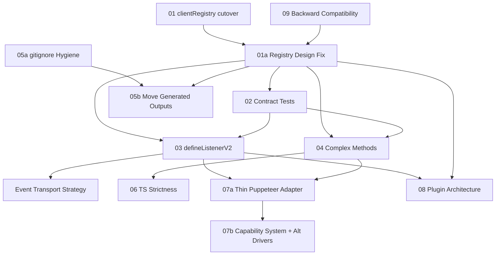

# v5 Migration Analysis Report (Enhanced)

**Date**: January 24, 2026  
**Analyst**: AI Code Analysis (Sisyphus + Oracle + Metis + Researcher)  
**Status**: v5.0.0-alpha.1 → v5.0.0 stable path

---

## Executive Summary

The wa-automate v4→v5 migration has achieved significant architectural modernization. The schema-first foundation is solid, but **critical integration work remains** before the v5.0.0 stable release.

### Critical Path

> **"Make schemas the source of truth at runtime"** (registry cutover + route/client generation) then **"restore the core bot loop"** (listeners).

### Migration Progress

| Category | Progress | Status |
|----------|----------|--------|
| Monorepo Structure | 100% | ✅ Complete |
| Schema Infrastructure | 100% | ✅ Complete |
| Standard Methods (Category 1) | 121/121 (100%) | ✅ Complete |
| Generator Cutover | 33% | 🔴 CRITICAL (2/3 generators still use legacy) |
| Server Route Registration | 0% | 🔴 CRITICAL BLOCKER |
| Listeners (Category 2) | 0/30 (0%) | ⏳ Needs defineListenerV2 |
| Complex Methods (Category 3) | 0/40 (0%) | ⏳ Needs custom implementations |
| Contract Tests | 0% | 🔴 MISSING (needs creation) |

### Key Finding

**The schema-first system exists but isn't fully integrated.** Two of three generators and the Hono server still use the legacy `Registry` instead of `clientRegistry`. Additionally, the current `clientRegistry` design uses Zod schemas as map keys, which is awkward for lookups and iteration.

---

## Dependency Graph



---

## Recommended Implementation Order

### Week 1: Make v5 "Real" (CRITICAL PATH)

| Order | Issue | Effort | Risk | Description |
|-------|-------|--------|------|-------------|
| 1 | [01-clientregistry-cutover](./01-clientregistry-cutover.md) | 1 day | 🟡 Medium | Switch generators to clientRegistry |
| 2 | [01a-registry-design-fix](./01a-registry-design-fix.md) | 0.5 day | 🟡 Medium | Key registry by name, not schema |
| 3 | [02-contract-tests](./02-contract-tests.md) | 1 day | 🟢 Low | E2E test harness for v5 core loop |

### Week 2: Core Bot Loop (HIGH IMPACT)

| Order | Issue | Effort | Risk | Description |
|-------|-------|--------|------|-------------|
| 4 | [03-define-listener-v2](./03-define-listener-v2.md) | 2-3 days | 🟠 Major | Implement defineListenerV2 pattern |
| 5 | [04-complex-methods-migration](./04-complex-methods-migration.md) | 2-3 days | 🟠 Major | Critical subset only (decrypt, download, sendFileFromUrl) |

### Week 3: Build Hygiene (MEDIUM IMPACT)

| Order | Issue | Effort | Risk | Description |
|-------|-------|--------|------|-------------|
| 6 | [05a-build-cleanup-gitignore](./05a-build-cleanup-gitignore.md) | 0.5 day | 🟢 Low | Clean .gitignore and remove artifacts |
| 7 | [05b-build-cleanup-relocate](./05b-build-cleanup-relocate.md) | 0.5 day | 🟡 Medium | Move generated outputs (after 01a stabilizes) |
| 8 | [09-backward-compatibility](./09-backward-compatibility.md) | 1 day | 🟡 Medium | Deprecation plan for v4 API surface |

### Week 4: Polish (LOWER PRIORITY)

| Order | Issue | Effort | Risk | Description |
|-------|-------|--------|------|-------------|
| 9 | [06-typescript-strictness](./06-typescript-strictness.md) | 2-3 days | 🟢 Low | Incremental strict mode |
| 10 | [07a-browser-thin-adapter](./07a-browser-thin-adapter.md) | 2 days | 🟡 Medium | Eliminate direct Puppeteer imports |

### v5.1+ (POST-STABLE)

| Order | Issue | Effort | Risk | Description |
|-------|-------|--------|------|-------------|
| 11 | [07b-browser-capability-system](./07b-browser-capability-system.md) | 3+ days | 🔴 Critical | Full abstraction + Playwright driver |
| 12 | [08-plugin-architecture](./08-plugin-architecture.md) | Large | 🟢 Low | Vision document |

---

## Risk Assessment

### Highest Risk of Breaking Functionality

1. **03 defineListenerV2 (🟠 Major risk)**  
   - Touches runtime behavior, async timing, queueing, backpressure, and cleanup semantics
   
2. **07 Browser abstraction (🔴 Critical risk if done before stability)**  
   - High likelihood of subtle behavioral differences (navigation timing, event ordering)
   
3. **04 Complex methods (🟠 Major risk)**  
   - Depend on native modules (`sharp`), network behavior, message shape drift
   
4. **01 Registry cutover (🟡 Medium risk)**  
   - Breakage tends to be "obvious" (missing routes/spec/types), but still blocks releases

### Known Bugs to Fix Immediately

1. **Duplicate `stop` method** in `packages/wa-automate/src/server/hono-server.ts` (lines 210-214 and 224-228)
2. **Legacy Registry usage** in:
   - `packages/schema/scripts/gen-openapi.ts` (line 15)
   - `packages/schema/scripts/gen-types.ts` (line 21)
   - `packages/wa-automate/src/server/hono-server.ts` (lines 116, 128)
   - `packages/wa-automate/src/server/socket-manager.ts` (line 34)

---

## Architecture Decisions (from Oracle Consultation)

### Registry Design Fix (RECOMMENDED)

**Current**: `Map<z.ZodFunction, ClientFunctionMetadata>` (schema as key)  
**Problem**: Awkward lookups, can't use WeakMap for iteration  
**Solution**: Key by function name, store schema inside:

```typescript
export type MethodDefinition = {
  schema: z.ZodFunction<any, any>;
  meta: ClientFunctionMetadata & {
    inputSchema: z.ZodObject<any>;
    outputSchema: z.ZodTypeAny;
  };
};

const methodsByName = new Map<string, MethodDefinition>();

export const clientRegistry = {
  register(def: MethodDefinition) {
    methodsByName.set(def.meta.functionName!, def);
    return def.schema;
  },
  get(name: string) { return methodsByName.get(name); },
  getAll() { return [...methodsByName.values()]; },
};
```

### Listener Pattern Symmetry

**Make event registry follow same shape as method registry**:
- Stable key (eventName)
- Stored schema(s)
- Stored metadata
- Iterable output for generators

### Browser Abstraction Strategy

**Phase-gate for v5.0 stability**:
- **07a (v5.0)**: Thin adapter - no direct Puppeteer imports in core
- **07b (v5.1+)**: Capability system + Playwright driver

---

## Files in This Directory

| File | Description | Priority |
|------|-------------|----------|
| [00-v5-migration-analysis.md](./00-v5-migration-analysis.md) | This report | - |
| [01-clientregistry-cutover.md](./01-clientregistry-cutover.md) | Switch generators to V2 registry | 🔴 CRITICAL |
| [01a-registry-design-fix.md](./01a-registry-design-fix.md) | Improve registry keying strategy | 🔴 CRITICAL |
| [02-contract-tests.md](./02-contract-tests.md) | E2E test harness for v5 core | 🔴 CRITICAL |
| [03-define-listener-v2.md](./03-define-listener-v2.md) | Listener pattern design | 🟡 HIGH |
| [04-complex-methods-migration.md](./04-complex-methods-migration.md) | Complex method migration | 🟡 HIGH |
| [05a-build-cleanup-gitignore.md](./05a-build-cleanup-gitignore.md) | Clean .gitignore | 🟢 MEDIUM |
| [05b-build-cleanup-relocate.md](./05b-build-cleanup-relocate.md) | Move generated outputs | 🟢 MEDIUM |
| [06-typescript-strictness.md](./06-typescript-strictness.md) | TypeScript improvements | 🟢 MEDIUM |
| [07a-browser-thin-adapter.md](./07a-browser-thin-adapter.md) | Thin Puppeteer adapter | 🟢 MEDIUM |
| [07b-browser-capability-system.md](./07b-browser-capability-system.md) | Full browser abstraction | 🔵 LOW (v5.1+) |
| [08-plugin-architecture.md](./08-plugin-architecture.md) | Future plugin system | 🔵 LOW (vision) |
| [09-backward-compatibility.md](./09-backward-compatibility.md) | Deprecation plan | 🟢 MEDIUM |

---

## Success Criteria for v5.0.0 Stable

- [ ] `clientRegistry` drives all code generation (keys by function name)
- [ ] `clientRegistry` drives Hono route registration
- [ ] OpenAPI spec generated from V2 methods with namespace grouping
- [ ] Types generated from V2 schemas
- [ ] Contract tests validate core loop: registry → server → client → browser
- [ ] Core listeners work (onMessage, onAck, onStateChanged)
- [ ] Basic bot loop functional (receive → process → send)
- [ ] High-value complex methods work (decryptMedia, sendFileFromUrl)
- [ ] No build artifacts in src directories
- [ ] Backward compatibility layer for v4 method signatures
- [ ] Duplicate `stop` method bug fixed

---

## Best Practices Applied (from Research)

### Schema-First Design (tRPC/Hono patterns)
- Procedure-based composition with `defineMethodV2`
- Zod-to-OpenAPI metadata via `.openapi()` extension
- Single source of truth for types via `z.infer<T>`

### Event/Listener Patterns (mitt/tiny-typed-emitter)
- Typed event maps: `type WhatsAppEvents = { 'message': Message; ... }`
- Return cleanup function from registration
- Parse payloads at boundary using event schema

### Browser Abstraction (Crawlee patterns)
- Browser Controller abstraction with `launch()`, `newPage()`, `close()`
- Capability-gated features for non-portable APIs (CDP, stealth)

### Plugin Architecture (Medusa patterns)
- Lifecycle hooks: `setup()`, `onStart()`, `onStop()`
- Context object for client/events/storage access

---

## Long-Term Vision

The schema-first architecture enables:

1. **Plugin System**: Plugins define methods/listeners via schemas, auto-exposed by server
2. **MCP/ACP Support**: Compile schemas to AI agent tool definitions
3. **Multi-Protocol**: Generate REST, WebSocket, webhook handlers from same schemas
4. **Event Streaming**: S2.dev-style real-time event delivery

This vision is achievable because the foundation is correct. The remaining work is integration and completion.
