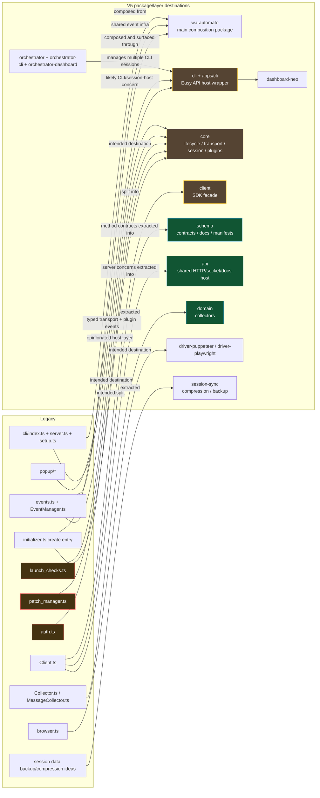

# v5 pseudo audit

Status: in progress  
Audit basis: `packages/legacy-documented/**/*.pseudo.md` and `*.proposed_improvements.md`  
Target under audit: current v5 work in progress across `packages/*`

---

## 1. Purpose of this document

This document is a staged audit of the current v5 implementation against the behavioral contracts extracted from the legacy system and documented in `packages/legacy-documented`.

This is **not** a one-shot verdict document. It is being written incrementally so each pass can stay evidence-based and avoid false certainty.

The goal is to answer, with maximum care:

1. what v5 already does well
2. what v5 intentionally changed in a good way
3. what legacy behavioral guarantees are currently missing
4. what regressions appear to have been introduced
5. what still needs to be audited in subsequent passes

---

## 2. Audit method for this pass

This pass is intentionally limited to **high-confidence observations** based on directly inspected source files.

### Benchmark source

The benchmark source for expected behavior is the documented legacy package in:

- `packages/legacy-documented/src/controllers/*.pseudo.md`
- `packages/legacy-documented/src/api/*.pseudo.md`
- `packages/legacy-documented/src/api/model/*.pseudo.md`
- `packages/legacy-documented/src/cli/*.pseudo.md`
- `packages/legacy-documented/src/events/*.pseudo.md`
- `packages/legacy-documented/src/logging/*.pseudo.md`
- `packages/legacy-documented/src/utils/*.pseudo.md`
- `packages/legacy-documented/src/structures/*.pseudo.md`
- `packages/legacy-documented/src/controllers/initializer.proposed_improvements.md`

### Evidence reviewed in this pass

The following v5 files were directly inspected during this pass:

- `packages/wa-automate/src/index.ts`
- `packages/wa-automate/src/cli-runtime.ts`
- `packages/wa-automate/src/server/hono-server.ts`
- `packages/client/src/index.ts`
- `packages/client/src/Client.ts`
- `packages/core/src/index.ts`
- `packages/core/src/createClient.ts`
- `packages/core/src/events/eventMap.ts`
- `packages/core/src/plugins/PluginHost.ts`
- `packages/core/src/transport/Transport.ts`
- `packages/schema/src/index.ts`
- `packages/schema/src/registry.ts`
- `packages/schema/src/implementor.ts`
- `packages/config/src/index.ts`
- `packages/wa-automate/src/session/SessionManager.ts`

### Confidence policy

- Items marked as findings below are grounded in code read during this pass.
- If something is only partially verified, it is labeled as an open question or follow-up target.
- Absence of evidence in this pass does **not** automatically mean the feature is absent everywhere in the repo.

---

## 3. Current v5 package shape: first high-confidence map

The current repo is already structurally very different from legacy. It is not a monolithic rewrite of `Client.ts`; it is a package-split architecture.

Relevant package set visible from `packages/`:

- `api`
- `cli`
- `client`
- `config`
- `core`
- `domain`
- `driver-interface`
- `driver-playwright`
- `driver-puppeteer`
- `hyperemitter`
- `logger`
- `orchestrator`
- `schema`
- `session-sync`
- `socket-client`
- `wa-automate`

### Initial interpretation

This is already a meaningful architectural departure from legacy:

- `schema` is now a first-class package
- `config` is a first-class package
- `client` is a thinner facade package
- `core` owns lifecycle/events/plugins/transport
- `wa-automate` appears to act as an app-facing composition package
- `session-sync` and `orchestrator` have been split out into dedicated concerns

This package decomposition is itself a **potential improvement**, not a regression.

### 3.1 User-clarified intended architecture (authoritative guidance)

The following architecture intent is now explicit from the user and should be treated as authoritative when judging v5:

1. `@open-wa/wa-automate` remains the **main npm package entrypoint** for the library.
2. That main package should expose/re-export the important user-facing layers such as:
   - CLI entry/runtime
   - SDK/client-facing runtime surface
   - other core exports as appropriate
3. The **CLI** is the v5 continuation of the old **Easy API** concept:
   - an opinionated host/runtime
   - implemented *on top of* the SDK
   - not the lowest-level session contract itself
4. The **SDK/client layer** owns the fundamental headless/CLI-less session behavior.
5. The SDK/client layer consumes browser drivers and generated client/schema surfaces.
6. Shared infrastructure like `hyperemitter` is intentionally usable from **both** SDK level and CLI level.
7. Plugin ecosystem goals exist at **both levels**:
   - SDK-level integrations/plugins
   - CLI-level integrations/plugins
8. The dashboard (`dashboard-neo`) is served alongside the CLI host.
9. The orchestrator CLI manages multiple CLI sessions and serves its own dashboard.

This clarification changes how several architecture decisions should be judged:

- not everything needs to live in the SDK/core layer
- not everything in the CLI layer is “leakage” or bad layering
- the important boundary is whether lower-level session fundamentals stop at SDK/core, and opinionated integrations remain above that line

---

## 3.2 Current package evidence that aligns with the intended architecture

### Main package as primary entrypoint

Evidence:

- `packages/wa-automate/package.json`

Observed behavior:

- package name is `@open-wa/wa-automate`
- it owns the `wa-automate` binary
- it depends on `@open-wa/api`, `@open-wa/client`, `@open-wa/config`, `@open-wa/core`, `@open-wa/driver-puppeteer`, `@open-wa/schema`, `@open-wa/session-sync`

Interpretation:

- this matches the desired role of `wa-automate` as the top-level composition package rather than a low-level SDK package.

Important follow-up nuance:

- although `wa-automate` is clearly acting as the top-level composition package, the currently inspected `packages/wa-automate/src/index.ts` does **not yet visibly re-export the SDK/client surface** in the way the clarified target architecture implies it eventually should.
- So the package role looks right, but the final public export composition may still be incomplete.

### CLI as Easy API wrapper/entry

Evidence:

- `packages/cli/package.json`
- `packages/cli/src/index.ts`

Observed behavior:

- `@open-wa/cli` depends on `@open-wa/wa-automate`
- `packages/cli/src/index.ts` simply re-exports `runCli`, `startCli`, and `parseCliArgs` from `@open-wa/wa-automate`

Interpretation:

- this strongly supports the idea that the CLI package is just a convenience entry/wrapper around the main package’s Easy API host behavior.
- That is architecturally consistent with the user’s clarified vision.

### App wrappers vs library packages are meaningfully separated

Evidence:

- `apps/cli/package.json`
- `apps/cli/src/index.ts`
- `apps/orchestrator-cli/package.json`
- `apps/orchestrator-cli/src/index.ts`
- `apps/dashboard-neo/package.json`
- `apps/orchestrator-dashboard/package.json`

Observed behavior:

- `apps/cli` is a private executable wrapper around `@open-wa/cli`
- `apps/orchestrator-cli` is a private executable wrapper around `@open-wa/orchestrator`
- `apps/dashboard-neo` and `apps/orchestrator-dashboard` are distinct UI applications rather than reusable library packages

Interpretation:

- this is an important sign of architectural discipline:
  - reusable logic primarily lives in `packages/*`
  - runnable binaries and dashboards live in `apps/*`
- this helps explain why not every runtime concern needs to be exportable from every library package.

### Orchestrator managing CLI sessions

Evidence:

- `packages/orchestrator/src/utils/resolve-easy-api-entry.ts`
- `packages/orchestrator/src/server.ts`

Observed behavior:

- orchestrator resolves and launches the `@open-wa/wa-automate` CLI entry (`dist/cli.cjs`)
- orchestrator exposes create/start/stop/restart/proxy/list/status style management endpoints

Interpretation:

- this aligns directly with the intended model that orchestrator manages multiple CLI/Easy API sessions rather than multiple raw SDK sessions.

### Dashboard served alongside CLI host

Evidence:

- `packages/api/src/dashboard/launcher.ts`
- `packages/api/src/createApiServer.ts`

Observed behavior:

- dashboard sidecar launch is built into the shared API server package
- dashboard is described as `dashboard-neo`
- it is started by default from API server config unless disabled
- it talks to Easy API via `@open-wa/socket-client`

Interpretation:

- this is strongly aligned with the architecture the user described.

### Orchestrator dashboard is distinct from the session dashboard

Evidence:

- `apps/orchestrator-dashboard/package.json`
- `packages/orchestrator/src/server.ts`

Observed behavior:

- there is a dedicated orchestrator dashboard app
- the orchestrator package remains focused on multi-session management/runtime endpoints

Interpretation:

- this matches the intended model where the orchestrator layer has its own management surface rather than reusing the session dashboard unchanged.

---

---

## 4. Current v5 runtime entry chain (inspected, not inferred)

### 4.1 What the app-facing package exports today

From `packages/wa-automate/src/index.ts`:

- exports `WAServer`
- exports `APILifecycleManager`
- exports `SessionManager`
- exports CLI runtime helpers (`runCli`, `startCli`, `parseCliArgs`)
- re-exports `Config` and `ConfigSchema` from `@open-wa/schema`
- re-exports API server helpers

### 4.2 Immediate contrast with legacy

Legacy centered everything around a single authoritative bootstrap entrypoint: `create()`.

Current v5, at least from `@open-wa/wa-automate`, does **not** export a top-level `create()` equivalent from its package root in the inspected file.

That does **not** automatically mean v5 is wrong. It does mean the audit must explicitly test whether:

- v5 intentionally replaced “single create entrypoint” with a composed runtime host
- or whether the legacy entrypoint contract was accidentally lost

This is one of the most important audit threads going forward.

### 4.2.a Reframing this concern in light of clarified architecture

Given the user’s clarification, the absence of a top-level exported `create()` from `@open-wa/wa-automate` is **less important** than it first appeared.

The more correct question is now:

- does the SDK/client/core layer expose the fundamental session bootstrap contract clearly enough?
- and does `@open-wa/wa-automate` correctly act as the main composed package that re-exports the right surfaces?

So this concern should no longer be read as:

> “wa-automate must itself look like legacy create().”

It should instead be read as:

> “the lower-level SDK/bootstrap contract must exist clearly somewhere below `wa-automate`, and `wa-automate` should re-export/compose it appropriately.”

### 4.3 Current CLI runtime chain

From `packages/wa-automate/src/cli-runtime.ts`, the current CLI boot path is:

1. parse CLI flags into `ParsedCliArgs`
2. call `resolveConfig(...)` from `@open-wa/config`
3. force/merge defaults including:
   - `disableSpins: true`
   - `apiLifecycle: 'hybrid'`
   - `socketMode: true`
   - `host: '0.0.0.0'`
   - `port: 8002`
4. start `WAServer`
5. create `PuppeteerDriver`
6. call `createClient(...)` from `@open-wa/core`
7. create `Transport`
8. create `ClientFacade` from `@open-wa/client`
9. attach QR updates from `openwaClient.events` to the server
10. call `client.start()`

This is a crucial finding:

> The current v5 CLI starts the HTTP/API server **before** the WhatsApp client reaches ready state.

At first glance this looked like a likely readiness regression. After inspecting the shared API middleware, that conclusion needs refinement: v5 appears to intentionally allow the host/server shell to start early while blocking method invocation until the session is connected.

So the real audit question is no longer “does the server start too early?” but rather:

- which routes are safely available before client readiness
- whether those pre-ready surfaces are clearly communicated as such
- whether any user-facing/runtime-facing contract now incorrectly implies full readiness too early

---

## 5. First-pass comparison against legacy pseudo docs

This section only covers items that are already visible with high confidence from inspected files.

### 5.1 Strong improvements already visible in v5

#### A. Schema system is a genuine improvement, not a regression

Evidence:

- `packages/schema/src/registry.ts`
- `packages/schema/src/implementor.ts`

Observed behavior:

- methods are registered with metadata and schemas
- positional and object-parameter calling are both supported in `defineMethodV2`
- registry metadata includes namespace, action, licensing, HTTP mapping, parameter order, and documentation-friendly metadata
- `implementMethod(...)` turns registered schemas into runtime implementations with validation and argument normalization

Why this is materially better than legacy:

- legacy `Client.ts` was behavior-rich but documentation/contract extraction was much harder
- current v5 schema layer is explicitly designed to support docs, validation, metadata, and generators
- this aligns with the user’s note that replacing legacy `Client.ts` with a schema system is **not** itself a regression

Audit status:

- **classified as a good architectural change**
- still needs deeper sanity checking against legacy behavioral contracts later

#### B. Config handling is significantly more formalized

Evidence:

- `packages/config/src/index.ts`
- grep/test evidence in `packages/config/src/env.ts` and config tests

Observed behavior:

- config schema is first-class
- env loading is explicit and schema-driven
- merge/precedence logic is formalized in a package rather than buried in ad hoc CLI code

Why this matters relative to legacy docs:

- the legacy pseudo docs and improvement notes explicitly pushed toward centralized, unconditional env absorption and clearer config contracts
- v5 appears directionally aligned with that goal

Audit status:

- **provisionally classified as a good change**
- follow-up needed to ensure actual runtime consumers honor the config package consistently

#### C. Event model is much more explicit and benchmarkable

Evidence:

- `packages/core/src/events/eventMap.ts`
- `packages/core/src/plugins/PluginHost.ts`

Observed behavior:

- there is a typed event map with many launch/session/webhook/persistence events
- event metadata includes `internal` and `sensitive`
- plugin hook mapping already exists for common integration surfaces

Why this is strong:

- legacy relied on wildcard event patterns and session-scoped namespaces
- v5 now appears to be moving toward typed, semantically named event contracts
- this is especially important given the goal that socket/plugin mode becomes central in v5

Audit status:

- **classified as a likely improvement**
- follow-up needed to test whether actual emitted lifecycle coverage matches the legacy behavioral benchmark, rather than merely naming the events

#### D. Plugin host is a real architectural advancement

Evidence:

- `packages/core/src/plugins/PluginHost.ts`

Observed behavior:

- plugins are registered against a typed event surface
- plugins support specific mapped hooks and catch-all event hooks
- plugin errors are isolated and logged rather than crashing registration outright

Relative to legacy:

- this aligns with the new v5 direction where integration/plugin behavior should be first-class rather than bolted on after launch

Audit status:

- **classified as a strong intentional improvement**

---

## 6. High-confidence regressions or missing parity seen already

These are not speculative. They arise directly from code currently inspected.

### 6.1 No obvious top-level `create()` contract at the app-facing package root

Legacy benchmark source:

- `packages/legacy-documented/src/controllers/initializer.pseudo.md`
- `packages/legacy-documented/src/index.pseudo.md`

Legacy contract summary:

- one authoritative bootstrap entrypoint
- launch config normalization
- auth handling
- readiness gating
- event/logging/session persistence/injection finalization before public readiness

Current v5 observation:

- `packages/wa-automate/src/index.ts` exports composition pieces but not a visible `create()` equivalent

Why this matters:

- if v5 is intentionally moving away from `create()` then that needs to be documented as an intentional contract change
- if it is accidental, this is a major regression in ergonomics and migration clarity

Current classification:

- **open concern / likely regression unless justified as an intentional replacement contract**

### 6.2 CLI appears to expose server surfaces before WhatsApp client readiness

Evidence:

- `packages/wa-automate/src/cli-runtime.ts`

Observed sequence:

- server is created and started
- startup summary is printed
- only afterwards is the driver/client/transport created and `client.start()` called

Why this matters against legacy docs:

- legacy `initializer` benchmark strongly emphasizes that partial readiness must not be exposed as full readiness
- the new pseudo docs explicitly say the system should not expose a partially initialized client as ready

What is not yet proven:

- whether `WAServer.start()` exposes routes that require client readiness before `server.setClient(...)`

Current classification:

- **design difference with partial mitigation present; still requires deeper contract review**

### 6.3 CLI itself admits several missing legacy parity features

Evidence:

- `packages/wa-automate/src/cli-runtime.ts`

The code explicitly prints compatibility warnings for missing parity in areas such as:

- ready webhook delivery not yet wired
- swagger-stats parity not restored
- tunnel parity not restored
- Chatwoot / Twilio / BotPress integration flags not wired into v5 CLI boot path
- webhook registration parity not restored

This is valuable because it gives us direct self-reported gap markers from the current implementation.

Current classification:

- **confirmed missing parity**, not inferred

### 6.3.a Shared API layer is a real replacement surface, not just a stub

Evidence:

- `packages/api/src/createApiServer.ts`
- `packages/api/src/createApiMiddleware.ts`
- `packages/api/src/routes/meta.ts`
- `packages/api/src/docs/openapi.ts`
- `packages/api/src/socket/SocketManager.ts`
- `packages/api/src/compat/session-path.ts`

Observed behavior:

- v5 has a shared API package rather than embedding server behavior inside `Client.ts`
- the API package provides:
  - Hono-based API server construction
  - shared middleware generation
  - API-key and rate-limit middleware
  - socket capability dispatch via schema-defined methods
  - docs/meta routes for OpenAPI/Postman/basic commands/listeners
  - compatibility support for session-id-in-path requests
- `createApiMiddleware(...)` blocks invocation with `503` while the session is not connected unless lifecycle is explicitly set to `immediate`

Why this matters:

- this means the legacy `Client.middleware()` idea was **not** simply deleted; it was extracted into a dedicated API package
- that extraction is likely a good architectural move
- it also means earlier concerns about “server before client ready” must be interpreted through lifecycle gating rather than through startup order alone

Current classification:

- **good architectural extraction, but still behaviorally incomplete relative to full legacy parity**

### 6.4 Core launch flow is currently much thinner than legacy launch contract

Evidence:

- `packages/core/src/createClient.ts`
- `packages/core/src/transport/Transport.ts`

Observed current flow in `createClient().start()`:

1. emit `core.starting`
2. set session state to `STARTING`
3. `transport.initialize()`
4. `transport.navigate()`
5. set state to `AUTHENTICATING`
6. `transport.waitForQr()`
7. `transport.injectWapi()`
8. set state to `READY`
9. emit `core.started` and `client.ready`

Against legacy benchmark, what is visibly absent from this inspected path:

- update check/freshness behavior
- explicit session validity check before final readiness
- expired-session/nuke handling
- license preload/check/injection in the startup flow
- patch preload/apply flow in the startup path
- integrity check / repair-before-fail path
- explicit finalization step comparable to legacy `client.loaded()` semantics
- clear differentiation between authenticated vs QR merely generated

Important caution:

- some of these may exist elsewhere in the repo and not yet be wired into `createClient().start()`

Current classification:

- **high-confidence missing parity in the currently inspected launch path**

### 6.4.a Session state management in core is currently very light

Evidence:

- `packages/core/src/session/index.ts`

Observed behavior:

- current `SessionManager` in core primarily stores and emits state transitions
- visible states are only:
  - `STARTING`
  - `AUTHENTICATING`
  - `READY`
  - `DISCONNECTED`
  - `STOPPED`
- there is no visible richer auth/session-validity classification in the inspected file
- there is no visible persisted-session lifecycle logic in the inspected file

Relative to legacy pseudo docs:

- legacy launch/session flow distinguished materially different states and branches such as:
  - valid session reuse
  - QR-required flow
  - session invalid / nuke
  - phone unreachable
  - repair/retry/finalization states

Current classification:

- **likely substantial reduction in session-state richness in the currently inspected core layer**

### 6.5 `Transport.injectWapi()` is currently a stub-level implementation in inspected code

Evidence:

- `packages/core/src/transport/Transport.ts`

Observed behavior:

- emits before/after events
- sets `const success = true`
- returns success
- no visible actual WAPI injection logic in the inspected implementation

Current classification:

- **clear implementation gap** unless actual injection is delegated somewhere not yet inspected

### 6.6 `waitForQr()` currently proves QR generation, not authenticated readiness

Evidence:

- `packages/core/src/transport/Transport.ts`

Observed behavior:

- polls the QR canvas parent `data-ref`
- emits `launch.auth.qr.generated`
- resolves with QR data
- on timeout emits `launch.auth.timeout`

What it does not show in the inspected file:

- authenticated-state detection
- phone-out-of-reach distinction
- session-invalid detection
- QR scanned confirmation path tied to actual authenticated session

Current classification:

- **substantial auth parity gap in currently inspected transport/auth implementation**

---

## 7. Findings that look intentionally good even if incomplete

This section is important because not every difference is a regression.

### 7.1 Socket mode as default is aligned with the new direction

Evidence:

- `packages/wa-automate/src/cli-runtime.ts`
  - `socketMode: true` forced in resolved CLI overrides

This matches the new v5 direction stated by the user.

Classification:

- **good intentional change**

### 7.1.a Shared infrastructure across SDK and CLI is visible and aligned

Evidence:

- `packages/client/package.json`
- `packages/core/src/createClient.ts`
- `packages/client/src/Client.ts`
- `packages/api/src/dashboard/launcher.ts`

Observed behavior:

- `@open-wa/client` depends on `@open-wa/hyperemitter`
- core runtime uses `HyperEmitter`
- the dashboard sidecar explicitly communicates with Easy API through `@open-wa/socket-client`

Interpretation:

- the repo is already moving toward shared infrastructure across layers rather than duplicating layer-specific integration primitives.
- this is aligned with the plugin-at-both-levels vision.

Classification:

- **good architectural alignment**

### 7.2 Typed event map includes sensitive-event classification

Evidence:

- `packages/core/src/events/eventMap.ts`

This is better than legacy in one critical way: it creates an explicit place to reason about which events are sensitive.

That aligns well with the pseudo-doc benchmark requirements around observability and non-leakage.

Classification:

- **good intentional change**

### 7.3 Client facade is smaller and more modular by design

Evidence:

- `packages/client/src/Client.ts`

Observed behavior:

- facade composes core client + transport + method modules
- method groups are broken out by domain
- listener manager is separate
- collector functionality is imported from domain package

Why this is likely good:

- legacy `Client.ts` was huge and behavior-dense
- the new structure is more auditable and decomposed

Critical caution:

- this is only an improvement if the behavioral contracts still survive the decomposition

Classification:

- **architecturally positive, behaviorally still under audit**

### 7.3.a Current layering mostly supports the intended SDK/CLI separation

Evidence:

- `packages/client/src/Client.ts`
- `packages/core/src/createClient.ts`
- `packages/wa-automate/src/cli-runtime.ts`
- `packages/api/src/createApiServer.ts`

Observed layering:

- `core` owns runtime lifecycle/events/transport/plugins
- `client` is a user-facing facade over that runtime
- `api` is a shared server layer
- `wa-automate` composes the CLI/Easy API host

Interpretation:

- this is broadly the right layering for the clarified architecture
- the main remaining question is no longer “is the layering wrong?” but “is the lower-level session contract behaviorally complete enough?”

Classification:

- **layering mostly aligned; behavioral completeness still the larger issue**

### 7.3.b Package/app separation is healthier than the initial audit assumed

Evidence:

- `apps/cli/*`
- `apps/orchestrator-cli/*`
- `apps/dashboard-neo/*`
- `apps/orchestrator-dashboard/*`

Observed behavior:

- runnable binaries and dashboards are split into app packages
- reusable logic remains primarily in `packages/*`

Why this is good:

- this reduces pressure to force every runtime concern into a reusable library package
- it gives the architecture room to keep SDK/core reusable while letting CLI/orchestrator/dashboard shells remain opinionated

Classification:

- **good structural alignment**

### 7.4 Shared docs/meta surfaces are better separated than in legacy

Evidence:

- `packages/api/src/routes/meta.ts`
- `packages/api/src/docs/openapi.ts`
- schema registry/docs generation files already inspected earlier

Observed behavior:

- API explorer/docs are now served from a shared API layer
- command/listener inventories are generated from schema/event registry sources
- deprecated legacy routes like `/swagger-stats`, `/meta/codegen/:language`, and process-control routes are explicitly surfaced as deprecated/410 rather than silently missing

Why this is good:

- this is cleaner than the old mixed CLI/server/docs generation flow
- it aligns with the schema-first approach and makes the docs surface easier to reason about

Current classification:

- **good intentional change**

### 7.5 Session-path compatibility has not been ignored

Evidence:

- `packages/api/src/compat/session-path.ts`

Observed behavior:

- there is explicit compatibility logic for validating session-id-in-path requests when that mode is enabled

Why this matters:

- this suggests the v5 API layer is attempting to preserve old access patterns where practical instead of discarding them wholesale

Current classification:

- **small but positive compatibility signal**

### 7.6 Collector/listener semantics look meaningfully preserved in modular form

Evidence:

- `packages/client/src/events/EventManager.ts`
- `packages/domain/src/structures/Collector.ts`
- `packages/domain/src/structures/MessageCollector.ts`
- `packages/domain/src/index.ts`

Observed behavior:

- collector primitives have been moved into a dedicated `domain` package
- `MessageCollector` still exists as a first-class abstraction
- the client package now uses a `ListenerManager` that bridges typed runtime events into the old convenience listener surface (`onMessage`, `onAck`, `onStateChanged`, `onLogout`, etc.)
- listener registration includes payload validation against event schemas and optional queueing behavior

Why this matters relative to the pseudo docs:

- the legacy pseudo docs treated collectors and listener surfaces as important ergonomic/runtime primitives
- v5 appears to have preserved those ideas while making them more modular and more typed

Important caution:

- this does not yet prove full event parity; it only shows that the abstraction category itself was not lost

Current classification:

- **good architectural change with likely preserved intent**

---

## 8. First-pass audit table

| Area | Current v5 status in this pass | Initial judgment |
| --- | --- | --- |
| schema-driven method system | directly observed | strong improvement |
| config schema + env/merge package | directly observed | strong improvement |
| typed event map | directly observed | likely improvement |
| plugin host | directly observed | strong improvement |
| shared API extraction from Client.middleware-style behavior | directly observed | strong improvement |
| docs/meta generation via shared API + schema | directly observed | strong improvement |
| collector/listener abstraction split into client+domain packages | directly observed | likely improvement |
| main package as composed entrypoint | directly observed in package metadata | aligned with intended architecture |
| wa-automate re-export breadth (CLI + SDK/client + core conveniences) | top-level package role is correct, but inspected root exports still look incomplete | likely composition gap |
| app wrappers separated from reusable library packages | directly observed | good structural alignment |
| top-level create parity at wa-automate root | less relevant after clarified architecture; SDK bootstrap clarity matters more | reframed concern |
| CLI readiness gating | host starts early but API middleware blocks invocation when disconnected | design difference / needs deeper review |
| webhook/integration parity | explicitly warned as missing | confirmed missing parity |
| update-check parity | not seen in inspected startup path | likely missing |
| patch/license/integrity startup parity | not seen in inspected startup path | likely missing |
| auth-state differentiation | not seen in inspected startup path | likely missing |
| session-state richness in core | directly inspected and currently minimal | likely regression |
| WAPI injection implementation | currently stub-like in inspected transport | probable major gap |

---

## 9. Immediate next audit targets

The next pass should inspect, in order:

1. whether there is another v5 launch/auth controller outside `core/createClient.ts`
2. whether WAPI injection is implemented elsewhere and merely not wired in the inspected transport file
3. whether session validity, stale session, logout, and reinjection logic exists elsewhere in `core`, `driver-*`, or `wa-automate`
4. which API/server routes are intentionally allowed pre-ready and whether that contract is explicit enough
5. how much of the legacy `initializer` behavioral contract is meant to live in:
   - `core/createClient.ts`
   - `Transport`
   - `SessionManager`
   - server lifecycle
   - plugins
6. how schema-generated method surfaces map back onto the legacy client capability inventory

---

## 10. Provisional conclusion of this pass

The current v5 work is **not** merely a bad rewrite of legacy. There are real, meaningful architectural improvements already present:

- schema registry and method metadata
- dedicated config package with formal precedence handling
- typed event map with sensitive/internal metadata
- plugin host model
- package decomposition of major concerns

However, the current inspected startup/runtime path still appears to be **far below legacy behavioral completeness** in the areas that mattered most in the pseudo docs:

- launch-state richness
- auth-state richness
- readiness gating
- session validity handling
- license/patch/integrity lifecycle
- integration/webhook parity

So the current picture is:

> v5 is already architecturally more modern, but in the inspected runtime path it still looks behaviorally underbuilt relative to the legacy benchmark.

That is not the final audit conclusion. It is the correct high-confidence conclusion for this pass.

---

## 11. Second-pass additions: schema/API replacement surfaces vs launcher gaps

This section extends the first pass with additional directly inspected files in the API layer and core-adjacent runtime.

### Additional evidence reviewed in this extension

- `packages/api/src/createApiServer.ts`
- `packages/api/src/createApiMiddleware.ts`
- `packages/api/src/socket/SocketManager.ts`
- `packages/api/src/routes/meta.ts`
- `packages/api/src/docs/openapi.ts`
- `packages/api/src/compat/session-path.ts`
- `packages/api/src/invoke-client-method.ts`
- `packages/api/src/types.ts`
- `packages/schema/src/http-manifest.ts`
- `packages/core/src/session/index.ts`
- `packages/core/src/controllers/browser.ignore.ts`
- `packages/core/test/e2e/createClient.e2e.test.ts`
- `packages/schema/migration_plan_doc.md`

---

## 12. What the second pass clarifies

### 12.1 The schema/API/client split is not accidental; it is an explicit architecture

The background exploration and direct reads support the same conclusion:

- `schema` is the single source of truth for method definitions, metadata, and docs surfaces
- `api` uses that schema layer to build runtime method maps, docs, and socket dispatch
- `client` is a facade over core runtime + transport + domain methods
- `core` handles lifecycle, events, transport, plugins, and session state

This means the legacy `Client.ts` was not simply “shrunk”; it was decomposed into:

- schema contract layer
- runtime core layer
- typed facade layer
- shared API host layer

That decomposition is real and intentional.

### 12.2 The shared API layer is already more coherent than the old embedded middleware model

From direct inspection:

- `packages/api/src/createApiMiddleware.ts` validates request payloads against schema input definitions
- method invocation is driven by schema metadata and `parameterOrder`
- `invokeClientMethod(...)` reconstructs positional args from named payloads
- `routes/meta.ts` builds docs and command/listener inventories from registry sources
- `SocketManager` dynamically wires schema-defined methods over socket.io

This is important because it means v5 already has one of the key things legacy lacked:

> a single contract pipeline from schema definition -> runtime invocation -> HTTP/socket surface -> docs output

That is a major strategic improvement.

### 12.3 The launch contract still appears much less mature than the API/schema contract

This contrast is becoming clearer:

- schema/API/docs surfaces are relatively systematic
- launch/auth/session runtime appears comparatively underimplemented in the active path

This asymmetry likely explains why v5 can look strong architecturally while still feeling operationally substandard compared to the legacy runtime.

---

## 13. New high-confidence findings

### 13.1 The API layer has a meaningful lifecycle gate, not a naive always-open model

Evidence:

- `packages/api/src/createApiMiddleware.ts`

Observed behavior:

- middleware checks `isSessionConnected()`
- unless `apiLifecycle === 'immediate'`, it returns `503` while the session is not connected

Why this matters:

- it mitigates the earlier concern that the server shell being up necessarily means the session is falsely “ready”
- v5 clearly distinguishes:
  - server host availability
  - actual session readiness for method invocation

Audit impact:

- this reduces the severity of the earlier readiness concern
- but it does **not** fully remove it, because the UX/contract still needs evaluation: what is visible to users and integrations before session readiness, and is that explicit enough?

Classification:

- **good design element that partially mitigates readiness regression risk**

### 13.2 The schema migration plan explicitly confirms the intended direction

Evidence:

- `packages/schema/migration_plan_doc.md`

Observed goals:

- dual-mode inputs
- rich metadata
- runtime normalization
- automatic WAPI bridge through `this.pup`

Why this matters:

- it confirms that the schema direction was not an accidental detour
- it was explicitly designed to solve exactly the contract/discoverability/generation problems that legacy made hard

Classification:

- **good intentional redesign, confirmed by design documentation**

### 13.3 Core session state currently looks dramatically less expressive than legacy

Evidence:

- `packages/core/src/session/index.ts`

Observed behavior:

- `SessionManager` currently stores a single state value and emits state-change events
- there is no visible richer session-state model in the inspected file beyond:
  - `DISCONNECTED`
  - `STARTING`
  - `AUTHENTICATING`
  - `READY`
  - `STOPPED`

Compared with legacy benchmark expectations:

- this is far thinner than the state richness implied by the legacy pseudo docs
- the event map actually declares many finer-grained launch/session states and situations, but the inspected active core path does not appear to drive most of them yet

Classification:

- **likely real regression in operational/session-state richness, unless another uninspected layer owns it**

### 13.4 The event map looks ahead of the active implementation

Evidence:

- `packages/core/src/events/eventMap.ts`
- `packages/core/src/createClient.ts`
- `packages/core/src/transport/Transport.ts`

Observed contrast:

- event map defines a very rich launch/session/persistence/license/patch/reinject vocabulary
- active inspected runtime emits only a relatively small subset of that vocabulary in practice

Interpretation:

- this is not “no design”; it is “design declared faster than implementation completed”

This is an important audit distinction:

> v5 already knows many of the right contracts, but the active runtime path does not yet seem to honor them comprehensively.

Classification:

- **contract maturity ahead of runtime maturity**

### 13.5 `browser.ignore.ts` should be treated as parked migration material, not active runtime evidence

Evidence:

- `packages/core/src/controllers/browser.ignore.ts`

Observed behavior:

- this file contains much richer, legacy-style browser/session bootstrap logic including:
  - session data restoration
  - MD-specific behavior
  - quick auth interception
  - reinjection-oriented request handling
  - session data file lookup/delete logic
  - multi-step browser init and page prep
  - repeated WAPI script injection
- it also contains clearly draft/dev-oriented behavior such as devtools setup and Puppeteer-era implementation details

Additional context:

- `notes/issues/11-core-monorepo-refactor.md` explicitly maps both `controllers/browser.ts` and `controllers/browser.ignore.ts` toward `driver-puppeteer/`
- the active core transport currently exports only `Transport.ts`, and the inspected runtime path does not import `browser.ignore.ts`

Why this matters:

- it suggests some legacy browser/session behavior was preserved as migration material, but **not** that the active runtime currently benefits from it
- it also suggests the intended destination for much of that logic was driver-specific code, not necessarily the active core transport in its current form

This matters for audit tone:

- some gaps are “missing from active implementation”
- some ideas are “preserved in draft/parked migration code”
- these should not be counted as completed parity just because the code exists in-repo

Classification:

- **important evidence of incomplete migration, but not evidence of active runtime parity**

### 13.6 E2E coverage currently proves QR emission, not deep launch parity

Evidence:

- `packages/core/test/e2e/createClient.e2e.test.ts`

Observed behavior:

- current inspected E2E test verifies that `launch.auth.qr.generated` is emitted when QR appears
- that is useful, but narrow relative to legacy launch complexity

Implication:

- current runtime verification appears to focus on a small slice of launch behavior
- it does not yet reflect the breadth of the pseudo-doc benchmark surface

Classification:

- **test coverage currently appears much narrower than required behavioral parity**

---

## 14. Revised interpretation of the current v5 state

The strongest current interpretation is now:

1. **Architecture direction is mostly right**
   - schema-first contracts
   - separate config system
   - dedicated API layer
   - typed event system
   - plugin host
   - modular client/domain split

2. **Active runtime depth is not yet matching that architecture**
   - launch/auth/session behavior is still far thinner than legacy expectations
   - many of the right events/contracts exist on paper but not yet fully in the active path

3. **Some legacy-equivalent runtime logic may be parked, not lost**
   - `browser.ignore.ts` is strong evidence of that

This makes the problem statement more precise:

> v5 does not primarily suffer from bad architectural direction. It suffers from an incomplete translation of legacy runtime depth into the new architecture.

That is a much more actionable diagnosis than “v5 is just worse.”

---

## 15. Refined current judgment

### Good changes that appear directionally correct

- schema registry / implementor / manifest pipeline
- config package and precedence handling
- shared API server/middleware/docs extraction
- typed event map with sensitivity metadata
- plugin host model
- modular collector/listener split
- socket mode being treated as a central runtime concern

### Changes that are likely good but still need parity confirmation

- replacement of monolithic `Client.ts` with schema + core + facade + API split
- early server startup with middleware lifecycle gating

### Areas that currently look behaviorally behind legacy

- launch state richness
- authentication state richness
- session validity classification
- recovery/retry/reinject behavior in the active runtime path
- patch/license/integrity lifecycle in the active runtime path
- completeness of integration/webhook parity in CLI boot
- breadth of end-to-end runtime tests

### Areas where draft/parked code exists but active parity still cannot be claimed

- browser/session bootstrap depth in `browser.ignore.ts`
- richer reinjection/session restore ideas implied by the event map but not wired into the active startup path

---

## 17. Third-pass additions: parked migration code, session-sync extraction, and architecture mapping

### 17.1 Session compression/backup concerns appear to have been extracted out of browser code into `session-sync`

Evidence:

- `packages/session-sync/src/index.ts`
- `packages/session-sync/src/local-compression.ts`
- `packages/session-sync/src/s3-sync.ts`

Observed behavior:

- v5 has a dedicated `session-sync` package
- `LocalSessionCompression` watches a session directory and produces `.zst` archives on change with throttling
- `S3SyncManager` handles backup/restore/delete/existence checks for compressed session artifacts in object storage

Interpretation:

- this supports the user’s clarification that some ideas seen in `browser.ignore.ts` were draft-y or exploratory in that file
- it also shows that session compression/backup was not simply forgotten; it has been moved toward a dedicated package boundary

Classification:

- **good extraction, though not yet proof that it is integrated into the active session lifecycle**

### 17.2 Active runtime still does not appear to implement the richer launch features declared in the event map

Evidence:

- `packages/core/src/createClient.ts`
- `packages/core/src/transport/Transport.ts`
- `packages/core/src/events/eventMap.ts`

Observed contrast after targeted searches:

- event map declares launch/license/patch/reinject/stale-session/compression semantics
- active inspected startup path still mainly does:
  - initialize browser
  - navigate
  - wait for QR
  - inject WAPI (stub-like)
  - mark ready

Interpretation:

- the audit concern is now more precise:
  - v5 contract vocabulary is ahead of implementation
  - `browser.ignore.ts` does not close that gap
  - `session-sync` extraction does not close that gap unless integrated into startup/session lifecycle

Classification:

- **implementation gap remains real**

### 17.3 Current `client.start()` confirms the active bootstrap is still only a thin wrapper over core startup

Evidence:

- `packages/client/src/Client.ts`

Observed behavior:

- `client.start()` simply delegates to `_client.start()` from core
- no additional client-layer finalization equivalent to legacy `loaded()` is visible in the inspected method

Interpretation:

- this strengthens the current audit position that legacy “constructed vs really ready” semantics are not yet fully rebuilt in the active path

Classification:

- **likely missing readiness/finalization depth**

---

## 18. Mermaid mapping: legacy surfaces -> v5 destinations / status

### Reading the diagram

- **Improved**: schema/docs/API extraction and collectors/domain separation look like real wins.
- **Partial**: core/client/CLI layering is mostly right, but active behavioral parity is incomplete.
- **Missing or not yet active**: launch/auth/patch/integrity depth from legacy is not yet convincingly present in the active runtime path.

---

## 19. Capability ownership and evidence matrix (active vs declared vs parked vs not yet evidenced)

This matrix is intended to tighten the audit language. A behavior should only be called a **true regression** once:

1. the intended v5 owner is identified,
2. the active codepath for that owner is inspected,
3. the legacy-relevant behavior is still absent there.

Until then, findings should be classified as one of:

- **Active** — visibly implemented in the active runtime path
- **Declared only** — event/schema/contract exists, but active implementation is not yet evidenced
- **Parked** — draft or migration-era logic exists in non-active files/packages
- **Not yet evidenced** — no active or parked implementation was found in this pass

| Legacy capability / contract | Intended v5 owner | Current evidence state | Notes |
| --- | --- | --- | --- |
| Main npm composition entrypoint | `wa-automate` | Active | Package metadata and root exports confirm this role. |
| CLI as Easy API host | `wa-automate` + `cli` + `apps/cli` | Active | Clear composition/wrapper chain exists. |
| SDK/client as lower-level session surface | `client` + `core` | Active but incomplete | Structure exists, behavioral depth still under audit. |
| Schema-based client contracts | `schema` | Active | Strongly evidenced. |
| Shared API/docs/socket host | `api` | Active | Strongly evidenced. |
| Collector/listener abstractions | `client` + `domain` | Active | Preserved in modular form. |
| Dashboard alongside CLI host | `api` + `apps/dashboard-neo` | Active | Sidecar launcher and app package exist. |
| Orchestrator managing CLI sessions | `orchestrator` + `apps/orchestrator-cli` | Active | Strong evidence. |
| Orchestrator dashboard | `apps/orchestrator-dashboard` | Active | App exists; deeper linkage still to inspect later. |
| Rich launch/auth/session event vocabulary | `core/events` | Declared only | Event map is rich; active runtime emits only a subset in inspected path. |
| Session state richness comparable to legacy | `core/session` | Active but thin | Active owner inspected; currently much thinner than legacy. |
| WAPI injection in active startup | `core/transport` or adjacent active transport owner | Active but thin | Active `injectWapi()` exists in the startup path, but currently appears stub-like and no richer alternate active path was evidenced. |
| Session validity / stale-session detection | likely `core/session` + `core/transport` | Declared only | Event vocabulary exists; active behavior not evidenced. |
| Reinject / recovery loops | likely `core/session` + `core/transport` | Declared only / parked | Event map declares it; parked browser draft implies old ideas; active path not evidenced. |
| Patch lifecycle during launch | likely `core` transport/bootstrap | Declared only | Events declare it; active launch path does not yet show it. |
| License lifecycle during launch | likely `core` transport/bootstrap | Declared only | Same pattern as patch lifecycle. |
| Integrity / launch checks | likely `core` bootstrap | Not yet evidenced | No active equivalent found in inspected startup path. |
| Popup/QR side UI | likely CLI/Easy API host + dashboard surfaces | Active but changed | `/qr` endpoint and dashboard QR views exist; popup-style observer semantics are not one-to-one with legacy. |
| Session compression / backup | `session-sync` | Active as package, integration not yet evidenced | Package exists, but startup/runtime integration not yet proven. |
| browser.ts-era Puppeteer bootstrap depth | `driver-puppeteer` + `core` boundary | Parked | `browser.ignore.ts` exists as migration material, not active parity. |

### Current practical rule for the next pass

- **Do not** call something a full regression if it is only “declared only” or “parked”.
- **Do** treat “active but thin” findings as the highest-confidence parity problems.
- **Do** prioritize capabilities where the intended owner is already obvious and the active implementation is already inspected.

---

## 16. Next pass targets (updated)

The next pass should now focus on the highest-value unresolved questions:

1. inspect whether `browser.ignore.ts` is intended for migration, replacement, or deletion
2. inspect whether active WAPI injection exists outside `Transport.injectWapi()`
3. inspect whether auth/session repair logic exists elsewhere in active codepaths
4. inspect how `eventRegistry` in schema relates to `ListenerManager` and listener parity coverage
5. inspect the API/debug routes and compatibility/deprecation surfaces for what was intentionally not carried forward
6. inspect whether the SDK/client/core layer exposes a clear low-level session bootstrap contract that `wa-automate` can re-export appropriately
7. inspect whether `@open-wa/wa-automate` should re-export more of the SDK/client layer than it currently does

---

## 20. Resolution status for previously queued audit targets

This section records which earlier “next steps” are now materially resolved by later passes, and which remain open.

### Resolved enough for current audit confidence

#### A. `browser.ignore.ts` relevance

Current status:

- resolved enough for now

What we now know:

- it is not part of the active inspected startup path
- it contains parked legacy-heavy Puppeteer bootstrap logic plus draft/dev-era concerns
- it should be treated as migration material, not as evidence of active parity
- package-planning notes point toward `driver-puppeteer` as its likely conceptual destination

#### B. Whether another active bootstrap controller exists in `core`

Current status:

- resolved enough for now

What we now know:

- the active inspected `core` bootstrap is still centered on `createClient.ts` + `transport/Transport.ts`
- `core/src/controllers/` does not currently provide another active launch/auth controller beyond parked material

#### C. Session compression/backup being “lost”

Current status:

- resolved enough for now

What we now know:

- these concerns were extracted into `packages/session-sync`
- that is a real architectural move, not simple omission
- what remains open is lifecycle integration, not package existence

### Still genuinely open

#### A. Active WAPI injection path completeness

Current status:

- still open, but narrowed

What we now know:

- the active inspected `Transport.injectWapi()` remains stub-like
- no alternate active implementation was evidenced in the searched active paths
- parked code does not close this gap

#### B. Active auth/session repair richness

Current status:

- still open, but increasingly likely to be a real active-path gap

What we now know:

- rich legacy auth/session repair semantics exist in benchmark docs and legacy code
- the active inspected v5 path does not yet evidence comparable state richness or repair loops
- event vocabulary alone is not enough to count as parity

#### C. Popup/QR side UI replacement

Current status:

- partially resolved

What we now know:

- the shared API server exposes an active `/qr` route when `ezqr` is enabled
- `dashboard-neo` actively renders QR/session state in its main session overview route
- the older dashboard app also has a dedicated `/qr` route
- what remains open is whether popup-style local auth observer behavior is intentionally replaced by these QR surfaces or still expected as a separate capability

#### D. SDK/bootstrap public contract clarity below `wa-automate`

Current status:

- partially resolved

What we now know:

- `@open-wa/core` actively exports `createClient`, `OpenWAClient`, events, plugins, session, and transport primitives
- `@open-wa/client` actively exports the `Client` facade plus collector/domain types
- this is enough to say the low-level bootstrap/SDK contract exists below `wa-automate`
- what remains open is its behavioral completeness and whether `wa-automate` should re-export more of that surface

---

## 21. Current pass conclusion

After the additional scans and oracle review, the audit is on firmer footing:

- package boundaries and product layering look increasingly intentional and aligned with the clarified architecture
- some earlier concerns have been downgraded from “possible regression” to “parked code / extracted subsystem / composition nuance”
- the remaining highest-confidence problems are concentrated in the active SDK/core bootstrap path itself, especially around injection, auth/session richness, and final readiness depth

So the current best reading is:

> the architecture is converging in the right shape, but the active lower-level runtime still does not yet convincingly satisfy the legacy behavioral benchmark in its bootstrap path.

---

## 22. Fourth-pass additions: listener parity plumbing, deprecation surfaces, and export-shape gaps

### 22.1 Event/listener parity is partially rebuilt through `eventRegistry` + `ListenerManager`

Evidence:

- `packages/schema/src/events/registry.ts`
- `packages/client/src/events/EventManager.ts`
- `packages/api/src/routes/meta.ts`

Observed behavior:

- `schema` owns a distinct `eventRegistry` for listener-facing event contracts and metadata
- `client` `ListenerManager` imports `eventRegistry` from `@open-wa/schema`
- listener registration is validated against event schemas and bridged from typed runtime events
- API meta routes expose listener inventories using that same registry

Interpretation:

- this means listener parity is more mature than some earlier high-level wording might suggest
- there is now a single event-contract path from schema -> client listener manager -> API explorer/docs
- the remaining open question is not whether listener parity machinery exists, but whether the underlying runtime emits enough of the expected events with legacy-comparable richness

Classification:

- **good architectural implementation with remaining runtime-depth questions**

### 22.2 API/debug routes are intentionally explicit about what is not being carried forward

Evidence:

- `packages/api/src/routes/debug.ts`
- `packages/api/src/routes/meta.ts`
- `packages/api/src/compat/deprecation.ts`

Observed behavior:

- dashboard-focused debug endpoints exist for memory, config inspection, process info, and integration config CRUD
- deprecated legacy surfaces are not silently dropped; they return redirects or `410` JSON with explicit replacement guidance
- examples include:
  - `/swagger-stats`
  - `/meta/codegen/:language`
  - `/meta/process/exit`
  - `/meta/process/restart`
  - `/disengage`

Interpretation:

- this is a positive sign of migration discipline
- some legacy features are being intentionally closed or replaced, rather than merely omitted without explanation

Classification:

- **good intentional change with explicit migration signaling**

### 22.3 The active public export shape still looks narrower than the clarified architecture implies

Evidence:

- `packages/client/src/index.ts`
- `packages/core/src/index.ts`
- `packages/wa-automate/src/index.ts`

Observed behavior:

- `@open-wa/client` exports the SDK facade and domain collector types
- `@open-wa/core` exports `createClient`, `OpenWAClient`, events, plugins, session, and transport primitives
- `@open-wa/wa-automate` currently exports:
  - `WAServer`
  - `APILifecycleManager`
  - `SessionManager`
  - CLI helpers
  - config/schema helpers
  - API server helpers
- `@open-wa/wa-automate` does **not** currently re-export obvious SDK/client entrypoints like `Client` or `createClient`

Interpretation:

- this does not make the architecture wrong, but it does mean the top-level product package has not yet fully realized the “main entrypoint re-exporting CLI, SDK, etc.” vision the user described

Classification:

- **likely composition/export-shape gap rather than runtime regression**

### 22.4 The current open popup/QR-side-UI question remains real

Evidence:

- dashboard surfaces exist
- no active popup-equivalent auth UI has yet been evidenced in inspected v5 runtime files

Interpretation:

- dashboards are not the same thing as the old popup auth observer contract
- this capability should remain open in the audit until a concrete replacement or deliberate non-goal is evidenced

Classification:

- **still open**

---

## 24. Fifth-pass additions: QR replacement surfaces and low-level SDK contract clarity

### 24.1 v5 has an active QR surface, but it is not a one-to-one popup port

Evidence:

- `packages/api/src/createApiServer.ts`
- `apps/dashboard-neo/src/routes/index.tsx`
- `apps/dashboard/src/routes/qr.tsx`

Observed behavior:

- the shared API server exposes `/qr` and returns the latest QR payload when `ezqr` is enabled
- `dashboard-neo` renders QR and session connectivity directly in its main session overview
- the older dashboard app contains a dedicated `/qr` route that fetches from the Easy API host

Interpretation:

- the old popup capability does have active replacement surfaces in v5
- however, those surfaces are API/dashboard-oriented rather than a local popup observer server with legacy semantics
- so parity here is better described as **active but changed** rather than “missing” or “fully preserved”
- based on later product clarification, the old temporary/local QR popup server should be treated as a legacy hack and **not** as a required parity target; `ezqr`-style QR surfacing is the intended forward direction, with local-only options to be reconsidered later if needed

Classification:

- **active replacement surface exists; local popup parity is an intentional non-goal for now**

### 24.2 The low-level SDK/bootstrap contract below `wa-automate` is now clear enough to name

Evidence:

- `packages/core/src/index.ts`
- `packages/client/src/index.ts`
- `packages/client/src/Client.ts`

Observed behavior:

- `@open-wa/core` exports `createClient`, `CreateClientOptions`, `OpenWAClient`, plus event/plugin/session/transport primitives
- `@open-wa/client` exports the `Client` facade and collector/domain helpers
- `Client` explicitly composes `OpenWAClient` plus `Transport` plus domain-specific method modules

Interpretation:

- the lower-level SDK/bootstrap contract is not missing; it is already distributed across `core` and `client`
- the remaining questions are:
  - whether that contract is behaviorally complete enough relative to legacy
  - whether the top-level `wa-automate` package should re-export more of it for ergonomic reasons

Classification:

- **resolved in structural terms; still open in behavioral completeness and top-level export ergonomics**

### 24.3 `wa-automate` export breadth is now clearly an ergonomics/composition question

Evidence:

- `packages/core/src/index.ts`
- `packages/client/src/index.ts`
- `packages/wa-automate/src/index.ts`

Observed behavior:

- the lower-level contracts already exist in dedicated packages
- `wa-automate` currently re-exports only a narrower composition subset

Interpretation:

- the unresolved issue here is no longer “missing SDK layer”
- it is “whether the main product package should surface more of the already-existing SDK/core entrypoints”

Classification:

- **composition/export-shape gap, not structural absence**

### 24.3.a `wa-automate` export breadth is likely below the clarified target architecture

Evidence:

- `packages/wa-automate/src/index.ts`
- `packages/cli/src/index.ts`
- user-clarified architecture intent recorded earlier in this document

Observed behavior:

- `wa-automate` currently exposes CLI helpers, API helpers, config/schema, and server/session-manager pieces
- it does not currently re-export the obvious lower-level SDK/client entrypoints that already exist in `@open-wa/core` and `@open-wa/client`
- `@open-wa/cli` is currently just a thin wrapper over `@open-wa/wa-automate`

Interpretation:

- if the clarified architecture is treated as authoritative, then the current `wa-automate` export shape likely falls short of the intended “main package re-exporting CLI and SDK” ergonomics
- this is not a runtime failure, but it does look like a real composition gap relative to the desired product surface

Classification:

- **high-confidence ergonomics/composition gap**

### 24.4 Active WAPI injection now looks more confidently like an active-path gap

Evidence:

- `packages/core/src/transport/Transport.ts`
- `packages/driver-puppeteer/src/index.ts`
- `packages/driver-playwright/src/index.ts`
- targeted searches across active `driver-*` and `core` packages

Observed behavior:

- the active startup path calls `Transport.injectWapi()`
- that method currently emits before/after events and returns `success = true` without visible injection logic
- no alternative active injection implementation was evidenced in the inspected `driver-puppeteer` or `driver-playwright` package surfaces
- the only active `window.WAPI...` usage found in `core` is the plugin proxy call path, not bootstrapping/injection logic

Interpretation:

- this meaningfully strengthens the earlier audit concern
- the item should no longer be treated as merely “not yet adequately evidenced” in a vague sense
- it is better classified as an **active-path implementation that currently appears too thin to satisfy legacy-equivalent injection behavior**
- later product clarification also upgrades the severity of this finding: preserving runtime WAPI injection is not optional in v5, it is a must-preserve core contract

Classification:

- **high-confidence active-path gap**

### 24.5 Active auth/session repair richness also looks more confidently like an active-path gap

Evidence:

- `packages/core/src/createClient.ts`
- `packages/core/src/transport/Transport.ts`
- targeted searches across active `core` and `driver-*` packages

Observed behavior:

- the active startup/auth path is still limited to:
  - browser init
  - navigation
  - QR wait
  - WAPI injection
  - ready state
- no active equivalents were evidenced for:
  - stale session / nuke detection
  - phone-out-of-reach differentiation
  - repair/reinject loops as active behavior
  - deeper authenticated-vs-QR-required branching comparable to legacy auth flow

Interpretation:

- this does not rely solely on the absence of code in one file anymore
- after targeted scans of the active lower layers, the likelihood that these are genuine active-path gaps is now higher
- this gap matters even more because the legacy launcher’s injection/repair behavior was tightly coupled to maintaining a live, patched runtime rather than just reaching a nominal READY state

Classification:

- **high-confidence active-path gap**

### 24.6 Final readiness/finalization depth also still looks thin in the active path

Evidence:

- `packages/core/src/createClient.ts`
- `packages/client/src/Client.ts`
- `packages/wa-automate/src/cli-runtime.ts`
- `packages/wa-automate/src/server/lifecycle-manager.ts`

Observed behavior:

- `createClient().start()` still transitions directly from QR wait and stub-like WAPI injection to `READY`
- `client.start()` in `@open-wa/client` is only a direct delegation to core startup
- CLI binds the client into the API server after `client.start()` returns and then prints readiness state
- `APILifecycleManager` comments explicitly note that hybrid mode is not yet the more advanced implementation it may eventually become

Interpretation:

- this strengthens the remaining concern that legacy-style “constructed vs truly finalized and ready” semantics are not yet deeply rebuilt in the active path
- the issue is not just missing auth richness; it is also the absence of a visibly deeper post-bootstrap finalization layer comparable to legacy `loaded()`/final checks/final patching semantics
- the legacy pseudo docs and improvement notes also make clear that patch and license overlay belong in this deeper finalization contract, not as optional postscript behavior

Classification:

- **high-confidence active-path gap**

---

## 25. Updated open-item status after this pass

### Now substantially narrowed

- popup/local QR server parity: **intentional non-goal; replaced directionally by ezqr/dashboard/API surfaces**
- low-level SDK/bootstrap contract: **exists clearly across core + client**

### Still highest-value unresolved items

1. whether the current `wa-automate` export breadth should be treated as a required product-surface change in this migration
2. how the must-preserve WAPI + patch + license-patch lifecycle should be re-established in the active lower-level runtime path

### Newly high-confidence gap findings

- active WAPI injection in the current startup path appears materially underimplemented
- active auth/session repair richness in the current startup path appears materially underimplemented
- final readiness/finalization depth in the current startup path appears materially underimplemented
- `wa-automate` export breadth appears materially narrower than the clarified target architecture

### Newly clarified non-goal

- temporary/local popup QR server parity should not be treated as a required migration target; `ezqr`-style replacement is the current intended direction

This is a significantly tighter unresolved set than earlier passes.

---

## 26. Authoritative priority clarification from product direction

The following should now be treated as authoritative guidance for subsequent migration work:

1. The old temporary/local QR popup server was always a disliked stopgap and should **not** drive parity requirements.
2. `ezqr`-style QR surfacing is the intended replacement direction for now.
3. The WAPI injection lifecycle is **core runtime behavior** and must be preserved in v5.
4. Live patch and license-patch application are also **core runtime behavior** and belong inside the lower-level runtime bootstrap/finalization contract.

This changes the priority ordering of remaining work:

- highest priority runtime gaps:
  1. WAPI injection
  2. patch lifecycle
  3. license-patch lifecycle
  4. auth/session repair richness tied to the above
  5. final readiness/finalization depth
- lower priority parity concern:
  - local popup observer UX

---

## 27. Target contract for the v5 lower-level bootstrap runtime

This section defines the target contract for the **lower-level v5 runtime bootstrap**, meaning the session/bootstrap behavior that should exist **below** the Easy API host layer and **below** dashboard/orchestrator concerns.

It is intentionally written as a **runtime contract**, not an implementation recipe. The goal is to specify what v5 must guarantee and what it may intentionally change.

### 27.1 Scope of this contract

This contract applies to the layer currently distributed across:

- `@open-wa/core`
- `@open-wa/client`
- the active transport/driver bootstrap path

This contract does **not** prescribe:

- exact browser library choices
- exact injection techniques
- exact patch transport/storage mechanisms
- exact terminal/TUI presentation
- exact dashboard/UI implementation

### 27.2 Contract classification

#### Required behavior

The following are required runtime obligations and must be preserved in v5:

1. ordered bootstrap phases
2. WAPI/runtime injection as a first-class bootstrap concern
3. live patch lifecycle as a first-class bootstrap/finalization concern
4. license-patch lifecycle as a first-class bootstrap/finalization concern
5. auth/session restoration and repair depth materially sufficient to avoid shallow false-readiness
6. a strict readiness gate that opens only after required runtime obligations are satisfied
7. externally observable lifecycle events and failure signals

#### Optional behavior

The following may vary without counting as regressions:

- update-check transport/mechanism
- exact QR/dashboard/local surfacing mechanics
- exact progress UX / terminal output
- extra diagnostics or extra repair heuristics beyond the minimum contract
- exact internal state object layout, provided the observable guarantees survive

#### Intentional non-goals

The following are explicitly **not** required parity targets for now:

- the old temporary/local QR popup observer server
- legacy MD/non-MD compatibility branching
- preserving legacy internal sequencing where it has no observable contract impact
- preserving legacy implementation shape purely for familiarity

### 27.3 Ordered bootstrap phases

The lower-level runtime should expose or internally satisfy the following ordered phases.

#### Phase A — config and runtime preconditions

Required outcome:

- runtime inputs are normalized enough that browser/session bootstrap can begin deterministically

Must include:

- resolved session identity
- resolved environment/config inputs
- resolved driver/transport prerequisites
- resolved policy inputs relevant to bootstrap (timeouts, session persistence, patch/license policy, readiness policy)

Must not do:

- start browser/page work before bootstrap-critical config is normalized
- silently accept contradictory runtime policy without normalization or explicit override rules

#### Phase B — browser/page bootstrap

Required outcome:

- a live page/browser runtime exists and is capable of navigation and later runtime injection work

Must include:

- browser initialization
- page creation
- initial navigation to WA Web
- enough page setup that auth detection and injection can proceed

Must not do:

- declare session readiness merely because a browser and page exist

#### Phase C — auth/session state determination

Required outcome:

- the runtime knows which of the materially different session/auth states it is currently in

At minimum, the contract should distinguish:

1. already authenticated / restored session is valid
2. interactive auth required
3. persisted session invalid or stale
4. timeout/offline/unreachable-style auth blockers

Must not do:

- collapse all non-success states into the same generic failure bucket
- proceed as though QR-generation alone implies a healthy session

#### Phase D — runtime injection bootstrap

Required outcome:

- the in-page runtime required for client method execution actually exists and is usable

This phase must treat WAPI/runtime injection as a real bootstrap obligation, not a ceremonial event emission.

Must include:

- actual runtime injection or equivalent runtime activation
- a verifiable success condition stronger than “no exception thrown”

May include:

- early injection and final injection as separate subphases
- idempotent reinjection behavior when needed

Must not do:

- emit successful injection lifecycle events without an actual corresponding runtime capability being established

#### Phase E — patch and license overlay lifecycle

Required outcome:

- required runtime overlays are applied only after the page/session is sufficiently valid to receive them

This phase should preserve the *contractual pattern* from legacy:

1. preload/fetch if needed
2. validate applicability
3. inject/apply
4. expose success/failure outcome

Must include separate handling for:

- live patch lifecycle
- license patch lifecycle

Must not do:

- blur WAPI injection, patch application, and license-patch application into one unobservable black box
- silently skip required overlays while still advancing to “ready”

#### Phase F — session validation and repair/finalization

Required outcome:

- the runtime has verified that the session is actually usable, and if repair is needed, the repair path has either succeeded or terminated clearly

Must include some equivalent to:

- session validity confirmation beyond raw page presence
- repair/retry/reinject path where appropriate
- integrity verification or capability verification after injection/overlay steps

Must not do:

- transition to ready immediately after a thin injection step if the runtime has not yet proven operational usability

#### Phase G — readiness gate and public exposure

Required outcome:

- only now may the runtime expose itself as operationally ready to upstream consumers

The readiness gate must mean more than “startup function finished.”

A valid `READY` should mean:

1. browser/page boot completed
2. auth state is resolved enough to proceed
3. runtime injection is actually usable
4. required patch/license overlay obligations are satisfied or explicitly classified as non-blocking
5. session validation/finalization obligations are satisfied
6. public client exposure is safe

### 27.4 Phase invariants

#### Invariant 1 — no false readiness

- The runtime must not emit or expose a public ready state while required bootstrap obligations remain incomplete.

#### Invariant 2 — explicit contract boundaries

- CLI/dashboard/server presence must not be confused with session readiness.
- A server may be up earlier, but runtime readiness for session-backed operations must remain separately gated.

#### Invariant 3 — observable lifecycle progression

- Major phase entry, success, degradation, and terminal failure should be externally observable through events/logs/health signals.

#### Invariant 4 — injection/overlay are real runtime work

- WAPI injection, patch application, and license-patch application must correspond to actual runtime effects, not only event declarations.

#### Invariant 5 — session/auth ambiguity must be reduced before exposure

- The runtime should not leave callers guessing whether it is waiting for QR, offline, stale, repaired, or actually ready.

### 27.5 Failure classes

The contract should classify failures by their effect on readiness.

#### Fatal bootstrap blockers

These forbid readiness entirely:

- browser/page bootstrap failure
- unrecoverable auth/session invalidity
- required WAPI/runtime injection failure
- required patch/license overlay failure when those overlays are mandatory for runtime safety
- terminal integrity/finalization failure

#### Repairable or retryable failures

These may delay readiness, but should not be silently collapsed:

- recoverable stale session state
- reinjection candidates
- transient page/runtime instability
- retryable patch/license fetch failures where cached or alternate strategy exists

#### Degraded but runnable states

These are allowed only if explicitly classified and surfaced as such:

- optional diagnostics unavailable
- optional non-core overlays skipped with explicit degraded status

### 27.6 Event obligations

The runtime should emit lifecycle events for:

1. browser/page init begin/end
2. navigation begin/end
3. auth check begin/end
4. interactive auth / QR or link-code state changes
5. WAPI injection begin/end
6. patch lifecycle begin/end
7. license lifecycle begin/end
8. session repair/reinject begin/end when applicable
9. finalization/readiness begin/end
10. terminal bootstrap failure

Event ordering requirement:

- no “ready” event may precede completion of required bootstrap obligations

Event quality requirement:

- event declarations without runtime emission in the active path are insufficient to count as parity

### 27.7 Readiness criteria

For audit purposes, the target v5 bootstrap should only be considered behaviorally acceptable if the lower-level runtime can answer all of the following:

1. What phase is bootstrap currently in?
2. If not ready, what exact blocker class is preventing readiness?
3. Has runtime injection actually happened, or has only a placeholder step completed?
4. Have patch and license overlay obligations run, and what were their outcomes?
5. Was session validity actively established, repaired, or merely assumed?
6. Why is the runtime considered ready right now?

### 27.8 Explicit non-prescriptions

This contract does **not** require:

- recursive restart style identical to legacy
- exact legacy update-check library/mechanism
- exact legacy popup server UX
- exact legacy patch transport endpoints or cache file names
- exact legacy class/file boundaries

It **does** require preserving the observable operational guarantees those mechanisms supported.

### 27.9 Audit use of this contract

This section changes the next audit standard:

- future runtime work should be judged against this contract first
- implementation details should only matter when they affect the observable guarantees above
- the current active v5 path should now be read as falling short specifically in:
  - Phase D runtime injection bootstrap
  - Phase E patch/license overlay lifecycle
  - Phase F session validation and repair/finalization depth
  - Phase G strict readiness gate

---

## 28. Active v5 bootstrap path vs target contract

This section compares the **currently inspected active v5 bootstrap path** against the target contract defined in Section 27.

### 28.1 Active path under comparison

The active path compared here is the code directly evidenced in:

- `packages/core/src/createClient.ts`
- `packages/core/src/transport/Transport.ts`
- `packages/core/src/session/index.ts`
- `packages/client/src/Client.ts`
- `packages/api/src/createApiMiddleware.ts`
- `packages/wa-automate/src/cli-runtime.ts`
- `packages/wa-automate/src/server/lifecycle-manager.ts`

High-level active sequence currently evidenced:

1. construct logger/events/session/transport/plugin host
2. initialize browser/driver
3. navigate to WA Web
4. set session state to `AUTHENTICATING`
5. wait for QR
6. call `injectWapi()`
7. set session state to `READY`
8. emit `core.started` and `client.ready`
9. CLI binds client/server surfaces and reports readiness

### 28.2 Status key used below

- **Pass** — active path materially satisfies the target phase contract
- **Partial** — active path covers some required behavior, but important contract obligations are missing
- **Declared-only** — events/contracts/schema exist, but active runtime behavior is not sufficiently evidenced
- **Absent** — no meaningful active-path evidence for the required behavior

### 28.3 Phase-by-phase comparison matrix

| Target phase | Active v5 evidence | Status | Audit reading |
| --- | --- | --- | --- |
| **A. Config and runtime preconditions** | `createClient()` resolves `sessionId`, logger, events, session manager, transport, plugin host; CLI resolves config via `resolveConfig(...)` before starting server/client. | **Partial** | Inputs are normalized enough to start, but active lower-level bootstrap does not yet show richer bootstrap-policy normalization equivalent to the legacy launcher contract. |
| **B. Browser/page bootstrap** | `Transport.initialize()` launches browser and page; `Transport.navigate()` goes to WA Web; emits begin/end browser and navigation events. | **Pass** | This phase is present and real in the active path. It is comparatively simple, but the minimum contract for browser/page bootstrap is materially satisfied. |
| **C. Auth/session state determination** | Active path sets state to `AUTHENTICATING`, then `waitForQr()` polls QR DOM and may emit QR-generated or auth-timeout events. No active evidence of restored-session-valid / stale-session / phone-unreachable distinctions. | **Partial** | There is active auth-related behavior, but it is far thinner than the target contract. The runtime does not yet appear to classify the materially distinct auth/session states required by Section 27. |
| **D. Runtime injection bootstrap** | `createClient().start()` calls `transport.injectWapi()`. Active implementation emits before/after events and returns hardcoded `success = true` without visible runtime injection logic. | **Absent (effective)** | There is a named step, but no evidenced actual runtime effect strong enough to count as satisfying the contract. This phase is effectively absent as a real operational guarantee. |
| **E. Patch and license overlay lifecycle** | Event vocabulary exists in `eventMap`, config accepts `licenseKey`, but no active fetch/apply/inject path was evidenced in active runtime files. | **Declared-only** | Contracts and config vocabulary exist, but the active bootstrap path does not currently satisfy the overlay lifecycle contract. |
| **F. Session validation and repair/finalization** | Session state manager exists but is minimal; no active integrity-check pass, no stale-session repair path, no reinjection flow, no post-bootstrap `loaded()`-style finalizer in active path. | **Absent** | This is one of the largest remaining gaps relative to legacy. The active path does not yet show the deeper finalization and repair semantics the target contract requires. |
| **G. Readiness gate and public exposure** | `createClient().start()` sets `READY` immediately after QR wait + stub-like `injectWapi()`; `client.start()` is a direct delegate; CLI then reports ready; API middleware does block invocation while disconnected unless lifecycle is `immediate`. | **Partial** | There is some lifecycle gating at the API layer, which is good. But the lower-level runtime still appears to inflate readiness before the deeper bootstrap obligations from Sections 27.D–27.F are satisfied. |

### 28.4 Invariant comparison

#### Invariant 1 — no false readiness

Current status: **not satisfied**

Reason:

- active path reaches `READY` after QR wait and stub-like injection, without evidenced patch/license/integrity/finalization completion.

#### Invariant 2 — explicit contract boundaries

Current status: **partially satisfied**

Reason:

- CLI/server presence is somewhat separated from method availability because API middleware can block invocation pre-connection.
- however, lower-level runtime readiness itself still looks too shallow.

#### Invariant 3 — observable lifecycle progression

Current status: **partially satisfied**

Reason:

- event vocabulary and emitted lifecycle steps exist for browser/navigation/QR/injection.
- but many richer lifecycle obligations are still only declared in the event map, not fully evidenced in active behavior.

#### Invariant 4 — injection/overlay are real runtime work

Current status: **not satisfied**

Reason:

- WAPI injection is currently not evidenced as real runtime work.
- patch/license overlay lifecycle is not evidenced as active runtime work.

#### Invariant 5 — session/auth ambiguity reduced before exposure

Current status: **not satisfied**

Reason:

- active path still appears too ambiguous between “QR surfaced”, “runtime ready”, and “session truly usable”.

### 28.5 Failure-class comparison

| Failure class from target contract | Active v5 handling status | Notes |
| --- | --- | --- |
| browser/page bootstrap failure | **Present** | Browser/page methods throw and startup would fail if initialize/navigate fail. |
| unrecoverable auth/session invalidity | **Weak / partial** | Timeouts exist at QR wait level, but deeper invalidity classes are not evidenced. |
| required WAPI/runtime injection failure | **Missing** | Injection does not appear to have a meaningful failure path because the active implementation is stub-like. |
| required patch/license overlay failure | **Missing** | No active overlay lifecycle is evidenced. |
| terminal integrity/finalization failure | **Missing** | No active integrity/finalization stage is evidenced. |
| repairable stale-session / reinject candidates | **Missing** | Declared in events, not evidenced in active flow. |
| degraded-but-runnable explicit mode | **Weak / unclear** | Some API lifecycle modes exist, but lower-level bootstrap degradation semantics are not yet explicit. |

### 28.6 Event-obligation comparison

#### Clearly active in current path

- browser init before/after
- navigation before/after
- QR requested/generated/timeout
- WAPI inject before/after
- `core.started`
- `client.ready`
- `session.state.changed`

#### Declared more richly than active path currently evidences

- patch lifecycle events
- license lifecycle events
- reinjection/session-stale/session-repair events
- richer launch finalization events

#### Audit implication

- the event surface is ahead of the active behavior it is meant to describe.

### 28.7 Readiness-gate comparison

The target contract says `READY` should only mean all of the following are true:

1. browser/page boot completed
2. auth state resolved enough to proceed
3. runtime injection actually usable
4. required patch/license overlay obligations satisfied or explicitly non-blocking
5. session validation/finalization obligations satisfied
6. public client exposure safe

Current active v5 path appears to satisfy:

- **1** browser/page boot completed — yes
- **2** auth resolved enough to proceed — only partially
- **3** runtime injection actually usable — not evidenced
- **4** patch/license obligations satisfied — not evidenced
- **5** session validation/finalization satisfied — not evidenced
- **6** public client exposure safe — only partially supported through API lifecycle gating

Conclusion:

- the current active readiness gate should be treated as **premature** relative to the target contract.

### 28.8 Net result of the phase comparison

The current active v5 bootstrap path is best summarized as:

- **solid enough at browser/page startup structure**
- **partially present at auth/QR surfacing**
- **materially underimplemented at runtime injection**
- **not yet materially implemented at patch/license overlay**
- **not yet materially implemented at validation/repair/finalization depth**
- **too shallow at the point where it declares readiness**

### 28.9 Immediate consequence for subsequent work

This comparison makes the implementation priorities unambiguous.

If the runtime is to satisfy the target contract, the highest-priority work is:

1. replace the current thin injection placeholder with a real runtime injection bootstrap
2. restore a real patch lifecycle
3. restore a real license-patch lifecycle
4. rebuild session validation / repair / finalization depth around those steps
5. only then reconsider whether `READY` is being emitted at the correct moment

---

## 23. Updated current picture after this pass

The audit is now more precise in three important ways:

1. **Listener and documentation plumbing are stronger than the launch path**
   - eventRegistry + ListenerManager + meta routes are coherent
   - docs/deprecation surfaces are deliberate

2. **Top-level export composition is still likely lagging behind the intended architecture**
   - `wa-automate` has the right role
   - but not yet the likely desired breadth of re-exports

3. **The remaining highest-confidence deficits are increasingly concentrated**
   - active WAPI injection path
   - active auth/session repair richness
   - readiness/finalization depth below CLI host
   - popup/QR observer replacement clarity

This is a better place to continue from than the earlier broader “v5 is underbuilt” framing.
